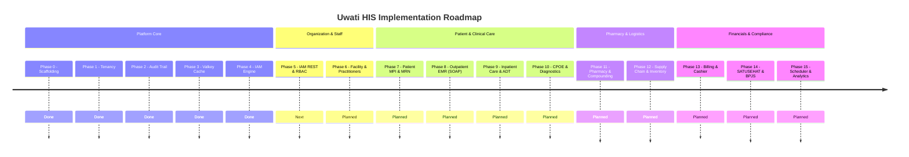

# Features and Roadmap

## Overview

**Uwati HIS** is a modern, backend-first, multi-tenant Hospital Information System (HIS) platform built with **Java 25**, **Spring Boot 4.1.0**, and **Hexagonal Architecture (Ports and Adapters)**.

The platform provides a scalable, secure, and compliance-ready foundation for healthcare institutions ranging from independent specialized clinics to multi-facility hospital networks. By decoupling pure healthcare business logic from infrastructure adapters, Uwati HIS enables flexible deployment models, pluggable authentication, low-latency distributed caching, immutable audit compliance, and seamless integration with national healthcare ecosystems (such as Indonesia's SATUSEHAT and BPJS Kesehatan).

---

## Target Market & Healthcare Segments

### Primary Users

- **Hospital & Clinic Leadership**: Medical Directors, Hospital Administrators, Chief Medical Officers (CMO).
- **Clinical Practitioners**: Physicians, Specialists, General Practitioners, Residents.
- **Nursing Staff**: Head Nurses, Ward Nurses, Triage Nurses, Shift Supervisors.
- **Allied Health Professionals**: Pharmacists, Pharmacy Technicians, Laboratory Technicians, Radiographers.
- **Administrative & Operations Staff**: Registration/Admissions Clerks, Medical Records Officers, Cashiers, Billing & Insurance Specialists.
- **Platform Operators**: System administrators managing multi-tenant hospital instances and cross-tenant infrastructure.

### Target Healthcare Segments

| Segment | Status | Target Capabilities |
|---|---|---|
| **General Hospitals (RSU Class B, C, D)** | 🟡 In Progress | Inpatient ADT, Emergency (IGD), Outpatient clinics, CPOE, Pharmacy, Cashier, SATUSEHAT & BPJS |
| **Specialized Hospitals (RSIA, Eye, Orthopedic)** | 🟡 In Progress | Departmental workflows, procedure scheduling, specialized clinical records, bed management |
| **Primary Care Clinics (Klinik Pratama & Utama)** | 🟡 In Progress | Fast-track registration, Outpatient EMR, prescription dispensing, point-of-sale billing |
| **Community Health Centers (Puskesmas)** | ⏳ Planned | Standardized public health reporting (Pcare/BPJS), epidemiological screening, rural-friendly workflows |
| **Integrated Pharmacy & Medical Centers** | 🟡 In Progress | Multi-warehouse inventory, recipe compounding (*racikan*), retail & prescription sales |

### Out of Scope (Near-Term)

- Standalone Native Picture Archiving and Communication System (PACS) DICOM rendering (will integrate via DICOMweb / external PACS viewers).
- Direct robotic surgical device control and real-time intensive care telemetry ingestion (M2M / IoT telemetry gateways planned for later phases).
- Full enterprise general-ledger accounting (Uwati HIS handles patient billing, cashiering, and charge capture; integrates with external accounting systems like Balaka via Store-and-Forward APIs).

---

## Architecture Principles & Core Foundation

Uwati HIS is structured under strict architectural boundaries to guarantee modularity, maintainability, and data security:

```
┌─────────────────────────────────────────────────────────────────────────────┐
│                                his-bootstrap                                │
│                (Aggregates modules, wires auto-configurations)              │
└──────────────┬──────────────────────────────┬───────────────────────────────┘
               │                              │
┌──────────────▼──────────────┐┌──────────────▼──────────────┐┌───────────────▼──────────────┐
│       his-persistence       ││           his-iam           ││          his-cache            │
│  - Tenant-Aware Repositories││  - Pluggable Auth (SPI)     ││  - Valkey / Redis Engine      │
│  - Liquibase Migrations     ││  - Scope Hierarchy Tree     ││  - Multi-Tenant Namespacing   │
│  - PostgreSQL Entities      ││  - Unified JWT Token Bridge ││  - Repository Decorators      │
│  - Immutable Audit Listener ││  - 3-Tier Security Scoping  ││  - Distributed Locks          │
└──────────────┬──────────────┘└──────────────┬──────────────┘└───────────────┬───────────────┘
               │                              │                               │
               └──────────────────────┬───────┴───────────────────────────────┘
                                      ▼
                       ┌──────────────────────────────┐
                       │          his-domain          │
                       │  - Pure Entities & Aggregates│
                       │  - TenantContext (ScopedValue│
                       │  - Ownership Contracts       │
                       │  - Auditable Ports & Events  │
                       └──────────────▲───────────────┘
                                      │
                       ┌──────────────┴───────────────┐
                       │           his-core           │
                       │  - Application Use Cases     │
                       │  - Pure Clinical Services    │
                       │  - Audit Diff Engine         │
                       └──────────────▲───────────────┘
                                      │
                       ┌──────────────┴───────────────┐
                       │           his-rest           │
                       │  - Inbound REST Controllers  │
                       │  - Request DTOs & Validation │
                       │  - Tenant Context Extraction │
                       └──────────────────────────────┘
```

1. **Hexagonal Architecture (Ports and Adapters)**:
   All business logic resides in `his-core` and `his-domain`. Adapters (`his-rest`, `his-persistence`, `his-cache`, `his-iam`) depend inward on core ports. Core logic has zero dependencies on web frameworks or ORMs.
2. **First-Class Multi-Tenancy**:
   Shared application and shared database with strict tenant discriminator enforcement (`TenantId`). Request boundaries use Java 25 `ScopedValue` for zero-leakage, thread-safe context propagation without mutable ThreadLocal hazards.
3. **3-Tier Data Ownership**:
   All entities and clinical records implement standard ownership boundaries:
   - `TenantOwned`: Top-level organizational boundary.
   - `ScopeOwned`: Department, ward, polyclinic, or laboratory boundary within a tenant's organizational hierarchy.
   - `UserOwned`: Personal ownership for authors, practitioners, or designated caretakers.
4. **Pluggable Subsystems (SPI Pattern)**:
   Identity providers (Local DB, OIDC/Keycloak, SAML 2.0, API Key) and cache layers are implemented as decoupled plugins.
5. **Immutable, Compliant Audit Trail**:
   Structured before/after JSON diffs recorded automatically for all auditable aggregates, ensuring regulatory traceability for medical and administrative operations.

---

## Implemented Features

### Phase 0: Modern Project Setup & Scaffolding (Complete)

- **Java 25 & Spring Boot 4.1.0**: Baseline runtime leveraging the latest platform features (records, pattern matching, scoped values).
- **Multi-Module Layout**: Clear segregation across `his-domain`, `his-core`, `his-rest`, `his-persistence`, `his-iam`, `his-cache`, and `his-bootstrap`.
- **Database Versioning**: Relational schema managed via Liquibase changelogs (`PostgreSQL 17+`).
- **Containerized Testing**: Testcontainers configuration for automated PostgreSQL and Valkey integration testing.

### Phase 1: Tenancy Platform & Isolation Core (Complete)

- **Multi-Tenant Data Model**:
  - `Tenant`, `TenantId` (UUIDv7 based), and `TenantStatus` (`ACTIVE`, `SUSPENDED`, `DEACTIVATED`).
  - Strict tenant discriminator columns on all tenant-owned tables.
- **Tenant Context Management**:
  - Lexically-scoped tenant context powered by Java 25 `ScopedValue` (`TenantContext`, `TenantContextScope`).
  - Servlet filter (`TenantContextFilter`) resolving `X-Tenant-Id` on inbound REST calls with validation safeguards.
- **Tenant Provisioning & Defaults**:
  - Idempotent tenant provisioning workflow (`CreateTenantService`).
  - Automatic initialization of default operational settings, locale, timezone, and numbering sequences.
- **Tenant Document Sequence Engine**:
  - Tenant-scoped sequence counters supporting configurable prefixes and date-formatted document numbers (e.g., `INV-2026-00001`, `MRN-000123`).
- **Tenancy REST API**:
  - `POST /api/v1/tenants` (provision tenant).
  - `GET /api/v1/tenants/{id}` & `GET /api/v1/tenants/{id}/settings`.
  - `PUT /api/v1/tenants/{id}/settings` (configure operational settings).

> Walkthrough reference: [tenant-management-walkthrough.md](tenant-management-walkthrough.md)

### Phase 2: Platform Observability & Unified Audit Trail (Complete)

- **Hexagonal Audit Design**:
  - Non-intrusive domain event publishing (`TenantCreated`, `TenantSettingsUpdated`).
  - Outbound audit listeners executing within database transaction boundaries (`BEFORE_COMMIT`).
- **Structured JSON Diffing**:
  - `AuditDiffEngine` calculating field-level old vs. new values (`{"fieldName": {"old": ..., "new": ...}}`).
  - Set and collection diffing tracking granular `added`, `removed`, and `changed` elements.
  - Exclusion of transient/technical timestamps to keep audit trails focused on business state.
- **Context & Traceability**:
  - `OperationContext` carrying initiating `actor` and `correlationId` (propagated via HTTP header `X-Correlation-Id`).
- **Append-Only Persistence**:
  - Dedicated `audit_entries` table partitioned by `tenant_id` and indexed for forensic queries.

> Walkthrough reference: [audit-trail-walkthrough.md](audit-trail-walkthrough.md)

### Phase 3: Distributed Caching & Performance Core (Complete)

- **Valkey Engine Integration**:
  - Powered by Linux Foundation's Valkey (`valkey/valkey:9.1.1-alpine`), a 100% open-source Redis drop-in replacement.
- **Zero-Leakage Multi-Tenant Namespacing**:
  - Automatic key partitioning: `uwati:tenant:{tenantId}:{cacheName}:{key}`.
  - Strict isolation preventing cross-tenant cache contamination.
- **Hexagonal Repository Caching (Decorator Pattern)**:
  - Cache wrappers (`CachedTenantSettingRegistry`) decorating JPA repositories without polluting domain layers with `@Cacheable`.
  - Real-time cache invalidation via domain event listeners (`TenantSettingCacheEvictor`).
- **Fault-Tolerant Cache Resilience**:
  - `ResilienceCacheErrorHandler` catching connection drops and timeouts, seamlessly falling back to PostgreSQL without disrupting user operations.
- **Distributed Lock Port**:
  - `DistributedLockPort` and `RedisDistributedLockAdapter` supporting atomic locks for high-contention operations (e.g., sequential numbering, bed allocation).

> Walkthrough reference: [cache-walkthrough.md](cache-walkthrough.md)

### Phase 4: Identity & Access Management (IAM) Foundation (Complete)

- **Vertical Plugin Scaffolding**:
  - Autonomous `his-iam` module with its own migrations (`db/iam/*`), entities, services, and controllers.
- **Pluggable Authentication Providers (SPI)**:
  - `AuthenticationProvider` interface supporting modular identity backends.
  - `LocalPasswordAuthProvider`: BCrypt password hashing with brute-force protection.
  - `OidcAuthProvider`: Federation with Keycloak and enterprise IdPs.
  - `ApiKeyAuthProvider`: Cryptographically verified machine-to-machine API keys.
- **Unified JWT Bridge**:
  - Decoupled `JwtTokenProvider` issuing standardized Uwati session tokens containing tenant, role, and scope claims.
  - Downstream modules interact strictly via the `CurrentActor` port.
- **Arbitrary-Depth Scope Hierarchy Engine**:
  - Tree structure supporting unlimited organizational depth (Hospital $\rightarrow$ Building $\rightarrow$ Department $\rightarrow$ Clinic/Ward $\rightarrow$ Room).
  - Materialized Path indexing (`/<tenantId>/<nodeA>/<nodeB>/`) enabling $O(1)$ subtree inheritance queries without recursive database joins.
- **3-Tier Data Ownership Contracts**:
  - `TenantOwned`, `ScopeOwned`, and `UserOwned` interfaces established in `his-domain`.

> Walkthrough reference: [iam-walkthrough.md](iam-walkthrough.md) and [plan/iam-plugin-architecture-plan.md](plan/iam-plugin-architecture-plan.md)

---

## Roadmap & Planned Features



---

### Phase 5: IAM Scoped RBAC, User Management & REST Administration

Complete the operational administration APIs for the IAM plugin.

- [ ] **Role & Permission Management API**:
  - CRUD operations for tenant roles and platform superadmin roles.
  - Granular permission registry (e.g., `clinical:record:write`, `pharmacy:dispense:approve`, `billing:invoice:void`).
- [ ] **User & Membership Management**:
  - User lifecycle management (invitation, status update, password reset, lockout unlock).
  - Multi-tenant user memberships and group memberships.
- [ ] **Scope Tree Administration**:
  - REST endpoints to add, rename, re-parent, and deactivate organizational scope nodes.
  - Automatic cascade re-indexing of materialized paths during organizational restructuring.
- [ ] **Effective Access Resolution**:
  - Pre-computed role and permission matrix combining direct user assignments, group inheritance, and downward scope inheritance.

---

### Phase 6: Organizational Structure, Facilities & Healthcare Practitioners

Model the physical and operational realities of healthcare institutions.

- [ ] **Organization & Facility Profiles**:
  - Healthcare organization legal profiles, license numbers (Izin Operasional RS/Klinik).
  - Multi-facility hierarchy: Main hospital, branch clinics, satellite laboratories.
- [ ] **Department & Service Unit Registry**:
  - Medical departments (Internal Medicine, Pediatrics, Surgery, Obgyn, etc.).
  - Non-medical units (Admissions, Billing Office, Central Pharmacy, Central Sterile Services).
- [ ] **Practitioner Registry**:
  - Doctor and specialist master data, SIP (Surat Izin Praktik) and STR numbers.
  - Practice schedules, room assignments, and polyclinic session allocations.
- [ ] **Staff & Clinical Roles Assignment**:
  - Mapping staff members to practitioners, nurses, or administrative operators.

---

### Phase 7: Patient Master Index (MPI) & Medical Record Numbering (MRN)

Establish the canonical identity of patients across all care episodes.

- [ ] **Patient Master Index (MPI)**:
  - Demographic profiles: Name, national ID (NIK / Passport), gender, birth date, mother's maiden name, blood type.
  - Contact information and emergency contacts / guarantors.
  - Deduplication and fuzzy search algorithms to prevent duplicate patient profiles.
- [ ] **Tenant-Scoped MRN Generation**:
  - High-concurrency Medical Record Number (Nomor Rekam Medis) sequence generator utilizing Valkey distributed locks.
  - Configurable formats per facility (e.g., 6-digit zero-padded, branch-prefixed).
- [ ] **Patient Categorization**:
  - Patient classification: General/Private (Umum), BPJS Kesehatan, Private Health Insurance, Corporate Contract.

---

### Phase 8: Outpatient Encounters, Triage & Electronic Medical Records (EMR)

Streamline the primary ambulatory workflow from registration to clinical documentation.

- [ ] **Encounter Lifecycle Engine**:
  - Encounter state machine: `REGISTERED` $\rightarrow$ `QUEUED` $\rightarrow$ `IN_TRIAGE` $\rightarrow$ `IN_CONSULTATION` $\rightarrow$ `PENDING_SERVICES` $\rightarrow$ `COMPLETED` / `CANCELLED`.
  - Queue management for polyclinics and doctor consulting rooms.
- [ ] **Triage & Vital Signs**:
  - Vital signs recording: Blood pressure, heart rate, respiratory rate, temperature, SpO2, height, weight, BMI, pain scale.
  - Triage classification (Emergency / Urgency levels).
- [ ] **SOAP Clinical Documentation**:
  - **Subjective (S)**: Chief complaint, history of present illness (HPI), allergy records.
  - **Objective (O)**: Physical examination findings, anatomical diagrams.
  - **Assessment (A)**: Primary and secondary diagnoses coded with **ICD-10**.
  - **Plan (P)**: Therapy, physician orders, clinical advice, follow-up scheduling.
- [ ] **Clinical Procedures & Services**:
  - Medical actions performed, coded with **ICD-9-CM**.

---

### Phase 9: Inpatient Care, Ward/Bed Management & ADT

Manage inpatient admissions, continuous care delivery, and bed occupancy.

- [ ] **Ward & Bed Infrastructure**:
  - Hierarchy: Building $\rightarrow$ Floor $\rightarrow$ Ward $\rightarrow$ Room $\rightarrow$ Bed.
  - Bed classes: VVIP, VIP, Class 1, Class 2, Class 3, ICU, ICCU, Isolation.
  - Real-time bed availability state: `AVAILABLE`, `OCCUPIED`, `RESERVED`, `CLEANING`, `MAINTENANCE`.
- [ ] **Admission, Discharge, Transfer (ADT) Workflows**:
  - Admission order from Emergency (IGD) or Outpatient polyclinic.
  - Bed reservation and patient check-in.
  - Inter-ward or inter-class transfers with automatic rate recalculation.
  - Discharge clearance workflows (clinical discharge by doctor, financial clearance by cashier).
- [ ] **Inpatient Daily Care & Nursing**:
  - Shift-based vital signs charts and medication administration records (MAR).
  - Nursing care plans, daily progress notes (CPPT - Catatan Perkembangan Pasien Terintegrasi).

---

### Phase 10: Computerized Provider Order Entry (CPOE) & Diagnostics

Coordinate diagnostic workups between clinicians and specialized units.

- [ ] **Laboratory Orders & Results**:
  - Order creation from EMR (hematology, urinalysis, chemistry, microbiology).
  - Specimen collection tracking and barcode labeling.
  - Result entry with reference ranges, abnormal flag indicators, and pathologist sign-off.
- [ ] **Radiology Orders & Reports**:
  - Imaging requests (X-Ray, Ultrasound, CT, MRI).
  - Radiologist diagnostic report drafting and electronic signature.
  - External PACS URL integration for direct image viewing.
- [ ] **General Clinical Orders**:
  - Dietary orders, physiotherapy consultations, nursing interventions.

---

### Phase 11: Pharmacy Management, Compounding & Dispensing

Deliver safety-checked medication fulfillment from prescription to handover.

- [ ] **Medicine Master Catalog**:
  - Generic vs. brand names, therapeutic classes, dosage forms, packaging units.
  - Multi-level unit conversion ratios (e.g., 1 Box = 10 Strips = 100 Tablets).
  - High-alert medications, psychotropics, and narcotics tracking.
- [ ] **Electronic Prescriptions (e-Prescribing)**:
  - Direct prescription submission from doctor's consultation view.
  - Support for finished drugs (*obat jadi*) and compounded recipes (*racikan*).
  - Compounding formulas: Ingredients, dose calculations, excipients, and instructions.
- [ ] **Pharmacy Dispensing Workflow**:
  - Prescription verification and clinical screening by pharmacists.
  - Stock reservation and picking allocation from designated pharmacy depots.
  - Label generation (signa, expiration date, patient instructions).
  - Final dispense handover and patient education recording.

---

### Phase 12: Healthcare Supply Chain, Purchasing & Multi-Warehouse Inventory

Maintain drug and medical consumable availability across hospital depots.

- [ ] **Multi-Warehouse Logistics**:
  - Inventory tracking across Central Warehouse, Outpatient Pharmacy, Inpatient Pharmacy, Emergency Depot, and Operating Room Depots.
  - Internal stock transfers and inter-depot requisitions.
- [ ] **Batch & Expiry Date Management**:
  - Strict Batch / Lot number tracking with expiration date auditing.
  - First-Expired, First-Out (**FEFO**) and First-In, First-Out (**FIFO**) automated stock picking.
- [ ] **Purchasing Lifecycle**:
  - Purchase Requisitions (PR) $\rightarrow$ Purchase Orders (PO) with supplier catalogues.
  - Goods Receipt Note (GRN) with batch verification and packing slip matching.
  - Purchase returns (*retur pembelian*) for damaged or recalled inventory.
- [ ] **Stock Audits & Threshold Alerts**:
  - Periodic stock opname workflows and discrepancy adjustments.
  - Minimum stock threshold monitoring and automated replenishment triggers.

---

### Phase 13: Point of Sale, Patient Billing & Financial Charge Capture

Consolidate clinical services and products into accurate patient bills.

- [ ] **Unified Charge Capture**:
  - Automatic charge accumulation from doctor consultations, room rates, lab tests, radiology scans, procedures, and dispensed medications.
  - Tariff schedules by patient class (Umum vs. Insurance vs. Corporate).
- [ ] **Invoicing & Billing Management**:
  - Interim billing for extended inpatient stays.
  - Final invoice generation with itemized cost breakdowns.
- [ ] **Cashier Operations & Payment Gateway**:
  - Multi-payment support: Cash, Debit/Credit Card, QRIS, Bank Transfer, Deposit deduction.
  - Patient deposit handling (down payments on admission).
  - Daily cashier shift opening, closing, and reconciliation reports.
- [ ] **Guarantor & Claims Ledger**:
  - Direct billing to third-party insurance and corporate partners.
  - Tracking outstanding accounts receivable (AR) by guarantor.

---

### Phase 14: Indonesian Healthcare Regulatory Integrations

Ensure compliance with Ministry of Health (Kemenkes) and BPJS mandates.

- [ ] **SATUSEHAT HL7 FHIR Integration**:
  - Automated translation of clinical data into HL7 FHIR standard resources:
    - `Patient` (mapped to NIK via SATUSEHAT Master Patient Index).
    - `Encounter` (admission, outpatient, discharge).
    - `Condition` (ICD-10 clinical diagnoses).
    - `Observation` (vital signs, laboratory results).
    - `Procedure` (ICD-9-CM interventions).
    - `MedicationRequest` & `MedicationDispense`.
  - Secure OAuth 2.0 gateway and asynchronous retry queue for Kemenkes API dispatch.
- [ ] **BPJS Kesehatan (V-Claim & Antrean Online)**:
  - Eligibility verification and Surat Eligibilitas Peserta (SEP) creation.
  - Synchronization with BPJS Antrean Online queue systems.
  - INA-CBGs grouper integration data staging.
- [ ] **National Hospital Reporting (SIRS Online / Kemenkes RL)**:
  - Automated aggregation for statutory reports (RL 1 to RL 5: bed capacity, morbidity, mortality).

---

### Phase 15: Background Scheduler, Real-Time Alerting & Hospital Analytics

Transform hospital operations into a proactive, data-driven environment.

- [ ] **Tenant-Aware Scheduler Adapter**:
  - Outbound scheduling port (`his-adapter-scheduler`) decoupled from Spring framework timers.
  - Execution of recurring hospital jobs: Inpatient daily room-rate posting at midnight, inventory expiration alerts, batch invoice closures.
- [ ] **Clinical & Operational Alerting**:
  - Critical laboratory panic value notifications sent directly to attending physicians.
  - Drug interaction alerts and allergy contraindication warnings.
- [ ] **Hospital KPI & Executive Dashboards**:
  - Bed Occupancy Rate (**BOR**).
  - Average Length of Stay (**ALOS**).
  - Bed Turnover Interval (**TOI**) & Bed Turnover Rate (**BTO**).
  - Net Death Rate (**NDR**) & Gross Death Rate (**GDR**).
  - Revenue, collection ratios, and pharmacy inventory turnover metrics.

---

## Healthcare Ecosystem Integration Strategy

Uwati HIS operates as a core clinical engine designed to coexist harmoniously with external medical hardware, regulatory services, and enterprise resource software:

```
                               ┌────────────────────────┐
                               │   SATUSEHAT (Kemenkes) │
                               │   HL7 FHIR Platform    │
                               └───────────▲────────────┘
                                           │ FHIR API (HTTPS/OAuth2)
                                           │
┌───────────────────────┐      ┌───────────┴────────────┐      ┌────────────────────────┐
│  Diagnostic Devices   │      │       Uwati HIS        │      │    BPJS Kesehatan      │
│  (Lab Analyzers,      ├─────►│     Core Backend       ├─────►│  (V-Claim, Antrean,    │
│   Digital Modalities) │ HL7  │  - Tenancy & Security  │ REST │   Pcare, INA-CBGs)     │
└───────────────────────┘ ASTM │  - Clinical Workflows  │      └────────────────────────┘
                               │  - Pharmacy & Supply   │
                               │  - Billing & Invoicing │
                               └───────────┬────────────┘
                                           │ Webhook / Store-and-Forward API
                                           ▼
                               ┌────────────────────────┐
                               │   Enterprise Finance   │
                               │     (e.g., Balaka)     │
                               │  - General Ledger      │
                               │  - Tax & Payroll       │
                               └────────────────────────┘
```

### Integration Pattern: Store and Forward (SAF)

For external integrations like national registries (SATUSEHAT) and enterprise accounting systems (such as [Balaka](https://github.com/artivisi/balaka)), Uwati HIS implements a **Store and Forward** pattern:

1. **Local Transaction Finality**: Clinical and financial transactions are committed locally within the tenant's relational database first.
2. **Outbox Event Dispatch**: An asynchronous event dispatcher reads pending integration payloads.
3. **Idempotent Delivery with Exponential Backoff**: Payloads carry idempotency keys (`idempotencyKey`) and correlation IDs, shielding the hospital from external network downtime.
4. **Dead Letter Queue (DLQ) & Operator Review**: Failed dispatches are flagged for administrative inspection without halting clinical operations.

---

## Documentation Index & Architecture Cross-References

For in-depth technical walkthroughs, domain contracts, and code examples, consult the dedicated guides:

| Document | Area | Description |
|---|---|---|
| [legacy-controller-revamp-map.md](legacy-controller-revamp-map.md) | **Architecture Map** | Modernization blueprint from legacy clinic MVC to multi-tenant hexagonal HIS. |
| [tenant-management-walkthrough.md](tenant-management-walkthrough.md) | **Tenancy** | Multi-tenant isolation model, `ScopedValue` context, and provisioning lifecycle. |
| [audit-trail-walkthrough.md](audit-trail-walkthrough.md) | **Audit Trail** | Hexagonal immutable audit architecture and JSON diffing engine. |
| [cache-walkthrough.md](cache-walkthrough.md) | **Caching** | Valkey engine integration, multi-tenant namespace partitioning, and resilience. |
| [iam-walkthrough.md](iam-walkthrough.md) | **IAM Walkthrough** | Pluggable Auth SPI, JWT bridge, and materialized path scope hierarchy. |
| [plan/iam-plugin-architecture-plan.md](plan/iam-plugin-architecture-plan.md) | **IAM Plan** | Detailed technical specification and implementation plan for the IAM plugin. |
