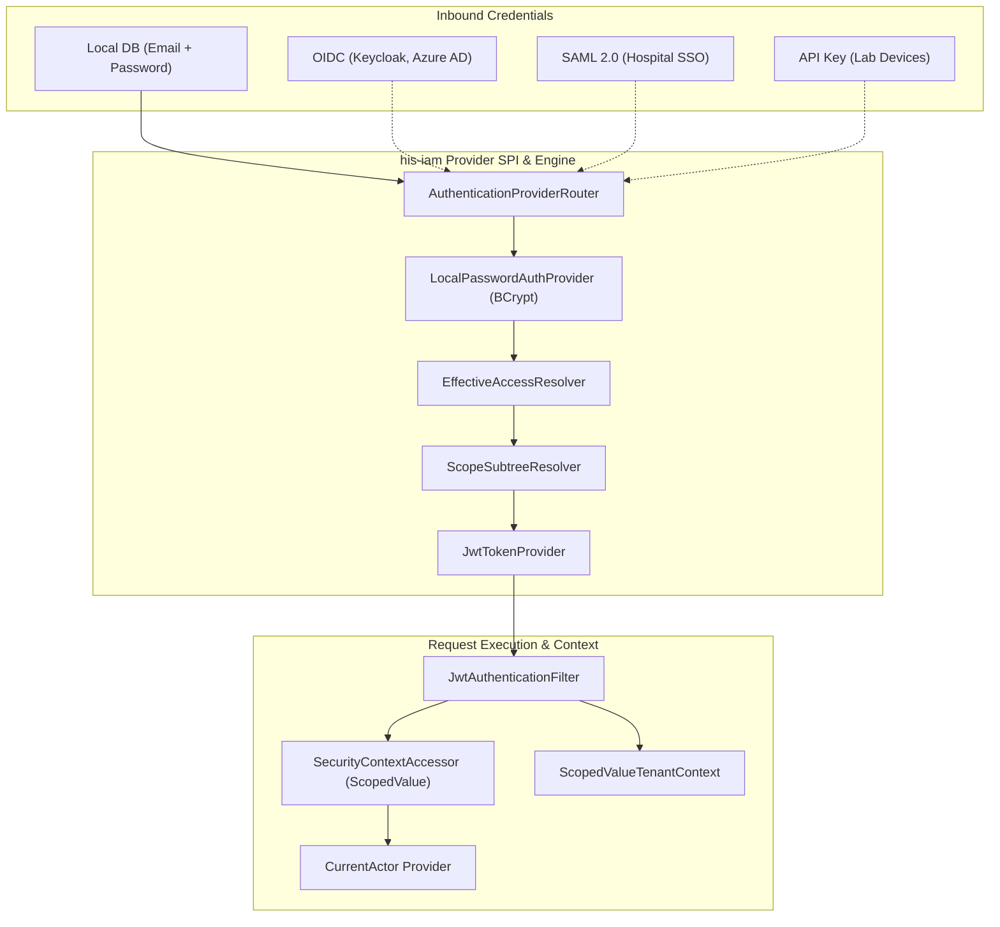

# Identity and Access Management (IAM) Walkthrough

This guide describes the pluggable **Identity and Access Management (IAM)** architecture, domain model, and hierarchical scoping engine in Uwati HIS.

This document is maintained and updated iteratively alongside the development process.

---

## 1. Overview & Core Capabilities

The `his-iam` module is a self-contained, vertical plugin that delivers:

1. **Pluggable Architecture**: Encapsulates its own domain, use cases, REST endpoints, JPA persistence entities, security filters, and Liquibase database migrations.
2. **Global Identity + Multi-Tenant Memberships**:
   - **Platform Superadmins**: Cross-tenant operators who manage system configurations and tenant lifecycles.
   - **Tenant Users**: Users bound to specific tenant organizations with tenant-scoped roles and user groups.
3. **Generic Hierarchical Scope Tree (Organizational Units)**:
   - Arbitrary nesting depth (Company $\rightarrow$ Division $\rightarrow$ Sub-Division $\rightarrow$ Department $\rightarrow$ Unit) without hardcoded enum levels.
   - High-performance downward subtree inheritance powered by **Materialized Paths** (e.g., `/<tenantId>/<nodeA>/<nodeB>/`).
4. **3-Tier Data Ownership Integration**:
   - Standardized ownership contracts (`TenantOwned`, `ScopeOwned`, `UserOwned`) consumed by HIS business modules.
5. **Pluggable Authentication Providers (SPI)**:
   - Common provider interface supporting Direct DB Passwords (BCrypt), OIDC (Keycloak/Azure AD), SAML 2.0, and API Keys.
   - Unified internal JWT bridge so downstream HIS services remain provider-agnostic.

---

## 2. Architecture & Module Boundaries

```
┌─────────────────────────────────────────────────────────────┐
│                       his-bootstrap                         │
│   (Aggregates modules, wires auto-configurations, starts)   │
└──────────────┬───────────────────────────────┬──────────────┘
               │                               │
┌──────────────▼──────────────┐ ┌──────────────▼──────────────┐
│       his-iam (Plugin)      │ │      his-core & adapters    │
│  - REST: /api/v1/auth, /iam │ │  - Pure clinical & biz logic│
│  - Pluggable Auth Providers │ │  - Consumes CurrentActor    │
│  - Scope Hierarchy Engine   │ │    and Ownership Contracts  │
│  - Security Filters & JWT   │ │                             │
│  - Migrations: db/iam/*     │ │                             │
└──────────────┬──────────────┘ └──────────────┬──────────────┘
               │                               │
               └───────────────┬───────────────┘
                               ▼
               ┌───────────────────────────────┐
               │          his-domain           │
               │  - TenantContext              │
               │  - CurrentActor Port          │
               │  - ScopeOwned & UserOwned     │
               │  - Auditable                  │
               └───────────────────────────────┘
```

---

## 3. Implementation Status & Progress Tracker

| Milestone | Scope & Deliverables | Status |
|---|---|:---:|
| **Phase 1: Foundation & Data Model** | Maven scaffolding, Liquibase migrations (`2026082601-create-iam-tables.json`), domain entities (`User`, `Role`, `Group`, `ScopeNode`, `UserRoleAssignment`, `GroupRoleAssignment`), ownership contracts in `his-domain` (`ScopeOwned`, `UserOwned`, `CurrentActor`). | ✅ **Completed** |
| **Phase 2: Scope Hierarchy & Subtree Engine** | `ScopeNode` path generation, re-parenting cascade, `ScopeHierarchyService`, `ScopeSubtreeResolver`, JPA entity & repositories, and subtree inheritance unit tests. | ✅ **Completed** |
| **Phase 3: Pluggable Auth & JWT Security** | `AuthenticationProvider` SPI, `LocalPasswordAuthProvider` (BCrypt), `EffectiveAccessResolver`, JWT token provider & claims builder, `JwtAuthenticationFilter`, `SecurityContextAccessor` bridge, `/api/v1/auth/*` endpoints (`/login`, `/refresh`, `/me`). | ✅ **Completed** |
| **Phase 4: Scoped RBAC, Groups & REST CRUD** | Use cases & REST controllers for Users, Roles, Permissions, Groups, Scope Tree, and assignments with lifecycle safeguards. | 🔄 *Next* |
| **Phase 5: Verification & Integration Tests** | Full Testcontainers integration tests, tenant context propagation, group inheritance, and bootstrap auto-configuration tests. | ⏳ *Planned* |

---

## 4. Domain Models & Contracts

### 4.1 3-Tier Ownership Contracts (in `his-domain`)

To enable row-level security and clear data segregation across clinical records, financial entries, and personal queues:

```java
// Tier 1: Tenant Boundary
public interface TenantOwned {
    TenantId tenantId();
}

// Tier 2: Department / Clinic / Ward Boundary
public interface ScopeOwned {
    UUID scopeNodeId();
}

// Tier 3: Individual Author / Personal Ownership
public interface UserOwned {
    UUID ownerUserId();
    default boolean isOwnedBy(UUID userId) {
        return ownerUserId() != null && ownerUserId().equals(userId);
    }
}
```

### 4.2 Security Context Actor Contract (`CurrentActor` in `his-domain`)

Exposes the authenticated principal to any downstream service without coupling to Spring Security:

```java
public interface CurrentActor {
    UUID userId();
    String email();
    UUID tenantId();
    boolean isPlatformSuperAdmin();
    boolean isTenantWide();
    Set<String> groups();
    Set<String> roles();
    Set<String> permissions();
    boolean hasPermission(String permission);
    boolean canAccessScope(UUID targetScopeNodeId);
    Set<UUID> accessibleScopeNodeIds();
}
```

---

## 5. Hierarchical Scope Engine & Lineage Paths

### 5.1 The Generic Scope Node Model

A `ScopeNode` represents an organizational unit (e.g. branch, division, department, clinic, or team). It does not use rigid enum types; depth is governed by tree structure:

```java
public record ScopeNode(
        ScopeNodeId id,
        TenantId tenantId,
        ScopeNodeId parentId,
        String code,
        String name,
        String path,              // Materialized path: /<tenantId>/<rootId>/<childId>/
        Instant createdAt,
        Instant updatedAt) implements Auditable {

    public static ScopeNode create(ScopeNodeId id, TenantId tenantId, ScopeNodeId parentId, 
                                   String code, String name, String parentPath, Instant now) {
        String calculatedPath = (parentId == null)
                ? "/" + tenantId.value() + "/" + id.value() + "/"
                : parentPath + id.value() + "/";
        return new ScopeNode(id, tenantId, parentId, code, name, calculatedPath, now, now);
    }
}
```

### 5.2 Downward Subtree Inheritance in Action

```
Tenant: City Health System (ID: T-100)
├── [Node A] Medical Services Division (Path: /T-100/A/)
│     ├── [Node B] Surgical Sub-Division (Path: /T-100/A/B/)
│     │     ├── [Node C] General Surgery Dept (Path: /T-100/A/B/C/)
│     │     └── [Node D] Orthopedics Dept (Path: /T-100/A/B/D/)
│     └── [Node E] Internal Medicine Sub-Division (Path: /T-100/A/E/)
│           └── [Node F] Cardiology Dept (Path: /T-100/A/E/F/)
└── [Node G] Operations Division (Path: /T-100/G/)
      └── [Node H] Central Pharmacy (Path: /T-100/G/H/)
```

- **Subtree Resolver (`ScopeSubtreeResolver`)**:
  - Given a user's assigned scope node $A$, resolves all accessible descendant nodes by matching prefix `path LIKE '/T-100/A/%'`.
  - In-memory tree builder generates structured `ScopeTreeNode` trees for UI navigation.

---

## 6. Pluggable Authentication & Security Architecture

### 6.1 Authentication Flow & Provider SPI



### 6.2 Provider SPI & Security Components

- **`AuthenticationProvider`**: Core SPI contract supporting extensible authentication mechanisms (`PASSWORD`, `OIDC_TOKEN`, `SAML_ASSERTION`, `API_KEY`).
- **`AuthenticationProviderRouter`**: Dynamically routes incoming credentials to the appropriate registered provider.
- **`LocalPasswordAuthProvider`**: Implements local database credential verification with BCrypt hashing and account lifecycle status checks (`ACTIVE`, `SUSPENDED`, `DEACTIVATED`).
- **`OidcAuthProvider`**: Validates federated OIDC ID token credentials and integrates with `FederatedIdentityService`.
- **`ApiKeyAuthProvider`**: Validates machine-to-machine API keys for lab devices and background worker processes via `ApiKeyValidatorPort`.
- **`FederatedIdentityService`**: Handles identity linking to `iam_user_identity` and Just-In-Time (JIT) user provisioning, synchronizing external IdP group claims with tenant `iam_group` mappings (`external_idp_group_name`).
- **`EffectiveAccessResolver`**: Resolves composite permissions, roles, and accessible scope nodes by aggregating direct user role assignments and group-inherited role assignments with subtree inheritance.
- **`JwtTokenProvider`**: Issues HMAC-SHA256 access and refresh tokens. Embeds rich contextual claims:
  - `sub`: User ID
  - `email`: User email
  - `tenantId`: Tenant UUID (null for platform superadmin)
  - `isSuperAdmin`: Platform superadmin flag
  - `isTenantWide`: Tenant-wide access flag
  - `groups`: List of assigned group codes
  - `roles`: List of effective role codes
  - `permissions`: Flattened distinct permission strings
  - `scopeNodeIds`: Accessible scope node UUIDs
  - `scopePaths`: Accessible materialized path prefixes
- **`SecurityContextAccessor`**: Modern Java 25 `ScopedValue`-based accessor implementing `CurrentActorProvider`. Guarantees clean thread-boundary isolation and automatic scope cleanup.
- **`JwtAuthenticationFilter`**: Spring `OncePerRequestFilter` that extracts `Authorization: Bearer <token>`, establishes the `CurrentActor` scope, and synchronizes the multi-tenant scope via `TenantContextScope`.

### 6.3 Authentication REST Endpoints

| Method | Endpoint | Request Body | Description |
|---|---|---|---|
| `POST` | `/api/v1/auth/login` | `LoginRequest(email, password, tenantId?)` | Authenticates credentials and returns JWT access + refresh tokens. |
| `POST` | `/api/v1/auth/refresh` | `RefreshTokenRequest(refreshToken)` | Validates refresh token and issues fresh access token. |
| `GET` | `/api/v1/auth/me` | *None (Requires Bearer token)* | Returns profile, assigned roles, permissions, and accessible scope hierarchy for current actor. |

---

## 7. Database Migrations (`his-iam`)

IAM migrations are isolated in `his-iam/src/main/resources/db/changelog/iam/`:
- **`2026082601-create-iam-tables.json`**:
  - `iam_user`: Core accounts and passwords.
  - `iam_user_identity`: Federated SSO external IDs.
  - `iam_group` & `iam_user_group_membership`: User groups and team mappings.
  - `iam_role` & `iam_role_permission`: Role and permission catalog.
  - `iam_scope_node`: Generic hierarchy tree with index on `path varchar_pattern_ops`.
  - `iam_user_role_assignment` & `iam_group_role_assignment`: Role-to-scope bindings.
- **`db.changelog-iam.json`**: Module changelog master.

---

## 8. Development Log & Changelog

- **2026-08-28 / 2026-08-30**:
  - Scaffolded `his-iam` module and multi-tenant domain models.
  - Added 3-Tier Data Ownership contracts (`ScopeOwned`, `UserOwned`) to `his-domain`.
  - Implemented Hierarchical Scope Tree, materialized path generator, re-parenting cascade, and `ScopeSubtreeResolver`.
  - Refactored `ManageScopeUseCase` and `ScopeHierarchyService` to use strongly-typed command DTO records (`CreateScopeNodeCommand`, `UpdateScopeNodeCommand`, `MoveScopeNodeCommand`, `DeleteScopeNodeCommand`) with self-encapsulated validation.
  - Implemented Pluggable Authentication Provider SPI (`AuthenticationProvider`, `AuthenticationProviderRouter`, `LocalPasswordAuthProvider` with BCrypt `PasswordEncoderPort`, `OidcAuthProvider`, `ApiKeyAuthProvider`).
  - Implemented `FederatedIdentityService` and `UserIdentityRepository` for Just-In-Time (JIT) provisioning and external IdP group mapping.
  - Implemented JPA persistence entities, Spring Data repositories, and adapters for `User`, `UserIdentity`, `Role`, `Group`, `UserGroupMembership`, `UserRoleAssignment`, and `GroupRoleAssignment`.
  - Implemented `EffectiveAccessResolver` resolving composite roles, permissions, and hierarchical scopes from direct and group assignments.
  - Implemented `JwtTokenProvider` issuing signed access and refresh tokens with custom claims, and `SecurityContextAccessor` / `JwtAuthenticationFilter` providing the `CurrentActor` bridge using Java 25 `ScopedValue`.
  - Implemented `AuthenticateUserUseCase`, `AuthenticationService`, and `/api/v1/auth/*` REST endpoints (`/login`, `/refresh`, `/me`) with `IamExceptionHandler`.
  - Added 89 unit & slice tests covering the entire IAM security subsystem with 100% pass rate.
  - Authored comprehensive `docs/iam-walkthrough.md`.
