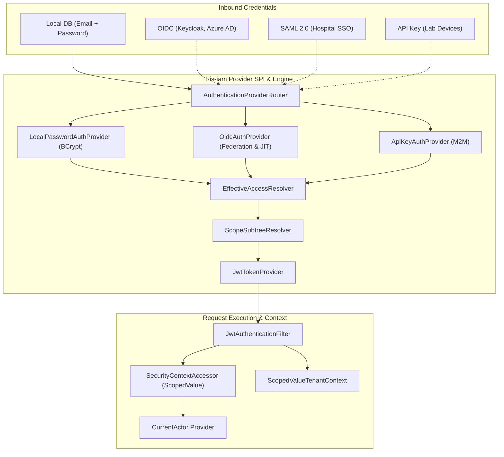
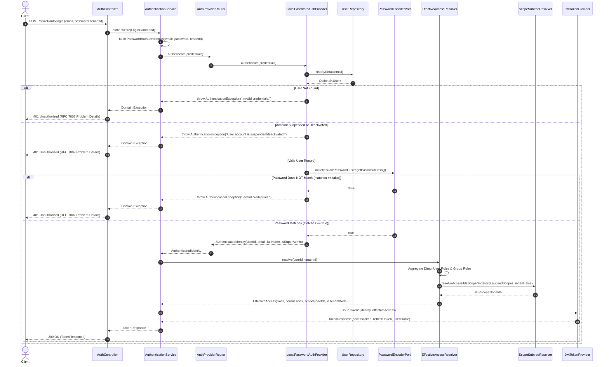
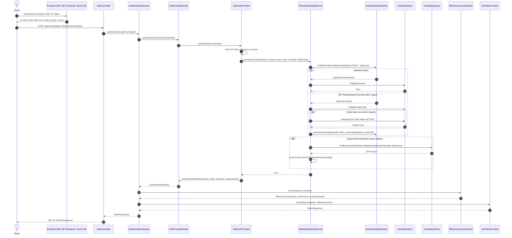
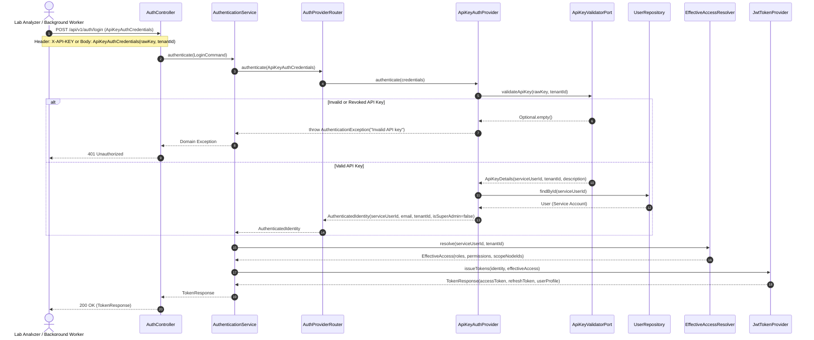
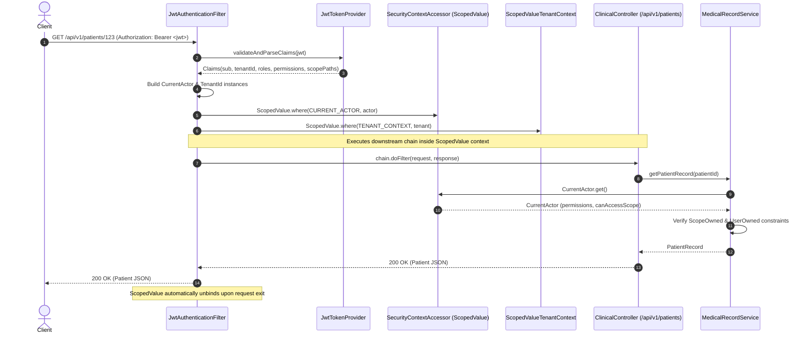

# Identity and Access Management (IAM) Walkthrough

This guide describes the pluggable **Identity and Access Management (IAM)** architecture, domain model, and hierarchical scoping engine in Uwati HIS.

This document is maintained and updated iteratively alongside the development process.

---

## 1. Overview & Core Capabilities

The `his-iam` module is a self-contained, vertical plugin that delivers:

1. **Pluggable Architecture**: Encapsulates its own domain, use cases, REST endpoints, JPA persistence entities, security filters, and Liquibase database migrations.
2. **Global Identity + Multi-Tenant Memberships**:
   - **Platform Superadmins**: Cross-tenant operators who manage system configurations and tenant lifecycles.
   - **Tenant Users**: Users bound to specific tenant organizations with tenant-scoped roles and user groups.
3. **Generic Hierarchical Scope Tree (Organizational Units)**:
   - Arbitrary nesting depth (Company $\rightarrow$ Division $\rightarrow$ Sub-Division $\rightarrow$ Department $\rightarrow$ Unit) without hardcoded enum levels.
   - High-performance downward subtree inheritance powered by **Materialized Paths** (e.g., `/<tenantId>/<nodeA>/<nodeB>/`).
4. **3-Tier Data Ownership Integration**:
   - Standardized ownership contracts (`TenantOwned`, `ScopeOwned`, `UserOwned`) consumed by HIS business modules.
5. **Pluggable Authentication Providers (SPI)**:
   - Common provider interface supporting Direct DB Passwords (BCrypt), OIDC (Keycloak/Azure AD), SAML 2.0, and API Keys.
   - Unified internal JWT bridge so downstream HIS services remain provider-agnostic.

---

## 2. Architecture & Module Boundaries

```
┌─────────────────────────────────────────────────────────────┐
│                       his-bootstrap                         │
│   (Aggregates modules, wires auto-configurations, starts)   │
└──────────────┬───────────────────────────────┬──────────────┘
               │                               │
┌──────────────▼──────────────┐ ┌──────────────▼──────────────┐
│       his-iam (Plugin)      │ │      his-core & adapters    │
│  - REST: /api/v1/auth, /iam │ │  - Pure clinical & biz logic│
│  - Pluggable Auth Providers │ │  - Consumes CurrentActor    │
│  - Scope Hierarchy Engine   │ │    and Ownership Contracts  │
│  - Security Filters & JWT   │ │                             │
│  - Migrations: db/iam/*     │ │                             │
└──────────────┬──────────────┘ └──────────────┬──────────────┘
               │                               │
               └───────────────┬───────────────┘
                                ▼
               ┌───────────────────────────────┐
               │          his-domain           │
               │  - TenantContext              │
               │  - CurrentActor Port          │
               │  - ScopeOwned & UserOwned     │
               │  - Auditable                  │
               └───────────────────────────────┘
```

---

## 3. Implementation Status & Progress Tracker

| Milestone | Scope & Deliverables | Status |
|---|---|:---:|
| **Phase 1: Foundation & Data Model** | Maven scaffolding, Liquibase migrations (`2026082601-create-iam-tables.json`), domain entities (`User`, `Role`, `Group`, `ScopeNode`, `UserRoleAssignment`, `GroupRoleAssignment`), ownership contracts in `his-domain` (`ScopeOwned`, `UserOwned`, `CurrentActor`). | ✅ **Completed** |
| **Phase 2: Scope Hierarchy & Subtree Engine** | `ScopeNode` path generation, re-parenting cascade, `ScopeHierarchyService`, `ScopeSubtreeResolver`, JPA entity & repositories, and subtree inheritance unit tests. | ✅ **Completed** |
| **Phase 3: Pluggable Auth & JWT Security** | `AuthenticationProvider` SPI, `LocalPasswordAuthProvider` (BCrypt), `OidcAuthProvider`, `ApiKeyAuthProvider`, `EffectiveAccessResolver`, JWT token provider & claims builder, `JwtAuthenticationFilter`, `SecurityContextAccessor` bridge, `/api/v1/auth/*` endpoints (`/login`, `/refresh`, `/me`). | ✅ **Completed** |
| **Phase 4: Scoped RBAC, Groups & REST CRUD** | Use cases & REST controllers for Users, Roles, Permissions, Groups, Scope Tree, and assignments with lifecycle safeguards (`ManageUserUseCase`, `ManageGroupUseCase`, `ManageRoleUseCase`, `ManageScopeUseCase`, `UserController`, `GroupController`, `RoleController`, `ScopeNodeController`). | ✅ **Completed** |
| **Phase 5: Verification & Integration Tests** | Full Testcontainers integration tests, tenant context propagation, group inheritance, and bootstrap auto-configuration tests. | ⏳ *Planned* |


---

## 4. Domain Models & Contracts

### 4.1 3-Tier Ownership Contracts (in `his-domain`)

To enable row-level security and clear data segregation across clinical records, financial entries, and personal queues:

```java
// Tier 1: Tenant Boundary
public interface TenantOwned {
    TenantId tenantId();
}

// Tier 2: Department / Clinic / Ward Boundary
public interface ScopeOwned {
    UUID scopeNodeId();
}

// Tier 3: Individual Author / Personal Ownership
public interface UserOwned {
    UUID ownerUserId();
    default boolean isOwnedBy(UUID userId) {
        return ownerUserId() != null && ownerUserId().equals(userId);
    }
}
```

### 4.2 Security Context Actor Contract (`CurrentActor` in `his-domain`)

Exposes the authenticated principal to any downstream service without coupling to Spring Security:

```java
public interface CurrentActor {
    UUID userId();
    String email();
    UUID tenantId();
    boolean isPlatformSuperAdmin();
    boolean isTenantWide();
    Set<String> groups();
    Set<String> roles();
    Set<String> permissions();
    boolean hasPermission(String permission);
    boolean canAccessScope(UUID targetScopeNodeId);
    Set<UUID> accessibleScopeNodeIds();
}
```

---

## 5. Hierarchical Scope Engine & Lineage Paths

### 5.1 The Generic Scope Node Model

A `ScopeNode` represents an organizational unit (e.g. branch, division, department, clinic, or team). It does not use rigid enum types; depth is governed by tree structure:

```java
public class ScopeNode implements TenantOwned {
    private final ScopeNodeId id;
    private final TenantId tenantId;
    private ScopeNodeId parentId;
    private String code;
    private String name;
    private String path;              // Materialized path: /<tenantId>/<rootId>/<childId>/
    private final Instant createdAt;
    private Instant updatedAt;
    // ...
}
```

### 5.2 Downward Subtree Inheritance in Action

```
Tenant: City Health System (ID: T-100)
├── [Node A] Medical Services Division (Path: /T-100/A/)
│     ├── [Node B] Surgical Sub-Division (Path: /T-100/A/B/)
│     │     ├── [Node C] General Surgery Dept (Path: /T-100/A/B/C/)
│     │     └── [Node D] Orthopedics Dept (Path: /T-100/A/B/D/)
│     └── [Node E] Internal Medicine Sub-Division (Path: /T-100/A/E/)
│           └── [Node F] Cardiology Dept (Path: /T-100/A/E/F/)
└── [Node G] Operations Division (Path: /T-100/G/)
      └── [Node H] Central Pharmacy (Path: /T-100/G/H/)
```

- **Subtree Resolver (`ScopeSubtreeResolver`)**:
  - Given a user's assigned scope node $A$, resolves all accessible descendant nodes by matching prefix `path LIKE '/T-100/A/%'`.
  - In-memory tree builder generates structured `ScopeTreeNode` trees for UI navigation.

---

## 6. Pluggable Authentication & Security Architecture

### 6.1 Authentication Flow & Provider SPI



### 6.2 Provider SPI & Security Components

- **`AuthenticationProvider`**: Core SPI contract supporting extensible authentication mechanisms (`PASSWORD`, `OIDC_TOKEN`, `SAML_ASSERTION`, `API_KEY`).
- **`AuthenticationProviderRouter`**: Dynamically routes incoming credentials to the appropriate registered provider based on `supports(AuthCredentialType)`.
- **`LocalPasswordAuthProvider`**: Implements local database credential verification with BCrypt hashing and account lifecycle status checks (`ACTIVE`, `SUSPENDED`, `DEACTIVATED`).
- **`OidcAuthProvider`**: Validates federated OIDC ID token credentials and integrates with `FederatedIdentityService`.
- **`ApiKeyAuthProvider`**: Validates machine-to-machine API keys for lab devices and background worker processes via `ApiKeyValidatorPort`.
- **`FederatedIdentityService`**: Handles identity linking to `iam_user_identity` and Just-In-Time (JIT) user provisioning, synchronizing external IdP group claims with tenant `iam_group` mappings (`external_idp_group_name`).
- **`EffectiveAccessResolver`**: Resolves composite permissions, roles, and accessible scope nodes by aggregating direct user role assignments and group-inherited role assignments with subtree inheritance.
- **`JwtTokenProvider`**: Issues HMAC-SHA256 access and refresh tokens. Embeds rich contextual claims (`sub`, `email`, `tenantId`, `isSuperAdmin`, `isTenantWide`, `groups`, `roles`, `permissions`, `scopeNodeIds`, `scopePaths`).
- **`SecurityContextAccessor`**: Modern Java 25 `ScopedValue`-based accessor implementing `CurrentActorProvider`. Guarantees clean thread-boundary isolation and automatic scope cleanup.
- **`JwtAuthenticationFilter`**: Spring `OncePerRequestFilter` that extracts `Authorization: Bearer <token>`, establishes the `CurrentActor` scope, and synchronizes the multi-tenant scope via `TenantContextScope`.

---

### 6.3 Authentication Provider Sequence Diagrams

#### 6.3.1 Local Password Authentication Flow (`LocalPasswordAuthProvider`)

The default authentication mechanism for direct database credentials using BCrypt password hashing:



---

#### 6.3.2 OIDC / SSO Federated Identity Flow (`OidcAuthProvider`)

Supports external enterprise Identity Providers (e.g., Keycloak, Azure AD, Okta) with automated Just-In-Time (JIT) user provisioning and external group claim synchronization:



---

#### 6.3.3 API Key Authentication Flow (`ApiKeyAuthProvider`)

Enables machine-to-machine (M2M) integration for automated laboratory equipment, background sync daemons, and HL7/FHIR adapters:



---

#### 6.3.4 Runtime Request Execution & Java 25 `ScopedValue` Context Binding

Illustrates how downstream business services access the authenticated actor and multi-tenant context safely across thread boundaries:



---

### 6.4 Authentication REST Endpoints

| Method | Endpoint | Request Body | Description |
|---|---|---|---|
| `POST` | `/api/v1/auth/login` | `LoginRequest(email, password, tenantId?)` | Authenticates credentials and returns JWT access + refresh tokens. |
| `POST` | `/api/v1/auth/refresh` | `RefreshTokenRequest(refreshToken)` | Validates refresh token and issues fresh access token. |
| `GET` | `/api/v1/auth/me` | *None (Requires Bearer token)* | Returns profile, assigned roles, permissions, and accessible scope hierarchy for current actor. |

---

## 7. IAM Management & Administration REST Endpoints

### 7.1 User Management (`/api/v1/iam/users`)

| Method | Endpoint | Description |
|---|---|---|
| `POST` | `/api/v1/iam/users` | Provisions a new user account with optional initial role and group binding. |
| `GET` | `/api/v1/iam/users` | Lists users matching optional search query (`search`) and lifecycle status (`status`) in a tenant. |
| `GET` | `/api/v1/iam/users/{id}` | Retrieves full user details including direct role bindings and linked SSO identities. |
| `PUT` | `/api/v1/iam/users/{id}` | Updates a user's full name. |
| `PATCH` | `/api/v1/iam/users/{id}/status` | Updates lifecycle status (`ACTIVE`, `SUSPENDED`, `DEACTIVATED`). |
| `PUT` | `/api/v1/iam/users/{id}/password` | Resets/updates user password. |
| `DELETE` | `/api/v1/iam/users/{id}` | Deletes a user and removes role bindings, memberships, and external identities. |
| `GET` | `/api/v1/iam/users/{id}/effective-access` | Computes and returns effective permissions, roles, and scope boundaries. |
| `GET` | `/api/v1/iam/users/{id}/identities` | Lists linked federated identities. |
| `DELETE` | `/api/v1/iam/users/{id}/identities/{identityId}` | Unlinks an external federated identity. |
| `GET` | `/api/v1/iam/users/{userId}/assignments` | Lists direct role-to-scope bindings. |
| `POST` | `/api/v1/iam/users/{userId}/assignments` | Binds a role to a user at tenant or scope level. |
| `DELETE` | `/api/v1/iam/users/{userId}/assignments/{assignmentId}` | Revokes a direct role assignment. |

### 7.2 User Groups & Teams (`/api/v1/iam/groups`)

| Method | Endpoint | Description |
|---|---|---|
| `POST` | `/api/v1/iam/groups?tenantId={id}` | Creates a user group with optional external IdP mapping. |
| `GET` | `/api/v1/iam/groups?tenantId={id}` | Lists all groups for a tenant. |
| `GET` | `/api/v1/iam/groups/{id}?tenantId={id}` | Retrieves group details. |
| `PUT` | `/api/v1/iam/groups/{id}?tenantId={id}` | Updates group metadata and IdP claim binding. |
| `DELETE` | `/api/v1/iam/groups/{id}?tenantId={id}` | Deletes a group and cascades cleanup to memberships and role bindings. |
| `GET` | `/api/v1/iam/groups/{id}/members?tenantId={id}` | Lists member users in a group. |
| `POST` | `/api/v1/iam/groups/{id}/members?tenantId={id}` | Adds a user to a group. |
| `DELETE` | `/api/v1/iam/groups/{id}/members/{userId}?tenantId={id}` | Removes a user from a group. |
| `GET` | `/api/v1/iam/groups/{id}/assignments?tenantId={id}` | Lists group-level role assignments. |
| `POST` | `/api/v1/iam/groups/{id}/assignments?tenantId={id}` | Assigns a role to a group at tenant or scope level. |
| `DELETE` | `/api/v1/iam/groups/{id}/assignments/{assignmentId}` | Revokes a group role assignment. |

### 7.3 Roles & Permissions (`/api/v1/iam/roles`, `/api/v1/iam/permissions`)

| Method | Endpoint | Description |
|---|---|---|
| `POST` | `/api/v1/iam/roles?tenantId={id}` | Creates a custom tenant role. |
| `GET` | `/api/v1/iam/roles?tenantId={id}` | Lists roles available to tenant (supports filter: `ALL`, `SYSTEM`, `CUSTOM`). |
| `GET` | `/api/v1/iam/roles/{id}` | Retrieves role definition and permissions. |
| `PUT` | `/api/v1/iam/roles/{id}` | Updates custom role details and permissions (system roles are immutable). |
| `DELETE` | `/api/v1/iam/roles/{id}` | Deletes a custom role (safeguarded against assigned roles and system roles). |
| `GET` | `/api/v1/iam/permissions` | Lists system permissions catalog. |

### 7.4 Scope Hierarchy (`/api/v1/iam/scopes`)

| Method | Endpoint | Description |
|---|---|---|
| `POST` | `/api/v1/iam/scopes?tenantId={id}` | Creates a root or child scope node. |
| `GET` | `/api/v1/iam/scopes?tenantId={id}&tree=true` | Returns nested scope tree representation (`ScopeTreeNode`). |
| `GET` | `/api/v1/iam/scopes?tenantId={id}&tree=false` | Returns flat list of scope nodes. |
| `GET` | `/api/v1/iam/scopes/{id}?tenantId={id}` | Retrieves scope node details. |
| `PUT` | `/api/v1/iam/scopes/{id}?tenantId={id}` | Updates scope node code and display name. |
| `PUT` | `/api/v1/iam/scopes/{id}/parent?tenantId={id}` | Moves/re-parents a scope node and cascades path updates to descendants. |
| `DELETE` | `/api/v1/iam/scopes/{id}?tenantId={id}` | Deletes a leaf scope node. |

---

## 8. Database Migrations (`his-iam`)

IAM migrations are isolated in `his-iam/src/main/resources/db/changelog/iam/`:
- **`2026082601-create-iam-tables.json`**:
  - `iam_user`: Core accounts and passwords.
  - `iam_user_identity`: Federated SSO external IDs.
  - `iam_group` & `iam_user_group_membership`: User groups and team mappings.
  - `iam_role` & `iam_role_permission`: Role and permission catalog.
  - `iam_scope_node`: Generic hierarchy tree with index on `path varchar_pattern_ops`.
  - `iam_user_role_assignment` & `iam_group_role_assignment`: Role-to-scope bindings.
- **`db.changelog-iam.json`**: Module changelog master.

---

## 9. Development Log & Changelog

- **2026-08-28 / 2026-08-30**:
  - Scaffolded `his-iam` module and multi-tenant domain models.
  - Added 3-Tier Data Ownership contracts (`ScopeOwned`, `UserOwned`) to `his-domain`.
  - Implemented Hierarchical Scope Tree, materialized path generator, re-parenting cascade, and `ScopeSubtreeResolver`.
  - Refactored `ManageScopeUseCase` and `ScopeHierarchyService` to use strongly-typed command DTO records (`CreateScopeNodeCommand`, `UpdateScopeNodeCommand`, `MoveScopeNodeCommand`, `DeleteScopeNodeCommand`) with self-encapsulated validation.
  - Implemented Pluggable Authentication Provider SPI (`AuthenticationProvider`, `AuthenticationProviderRouter`, `LocalPasswordAuthProvider` with BCrypt `PasswordEncoderPort`, `OidcAuthProvider`, `ApiKeyAuthProvider`).
  - Implemented `FederatedIdentityService` and `UserIdentityRepository` for Just-In-Time (JIT) provisioning and external IdP group mapping.
  - Implemented JPA persistence entities, Spring Data repositories, and adapters for `User`, `UserIdentity`, `Role`, `Group`, `UserGroupMembership`, `UserRoleAssignment`, and `GroupRoleAssignment`.
  - Implemented `EffectiveAccessResolver` resolving composite roles, permissions, and hierarchical scopes from direct and group assignments.
  - Implemented `JwtTokenProvider` issuing signed access and refresh tokens with custom claims, and `SecurityContextAccessor` / `JwtAuthenticationFilter` providing the `CurrentActor` bridge using Java 25 `ScopedValue`.
  - Implemented `AuthenticateUserUseCase`, `AuthenticationService`, and `/api/v1/auth/*` REST endpoints (`/login`, `/refresh`, `/me`) with `IamExceptionHandler`.
  - Added Section 9 to `.agents/rules/clean-code.md` establishing mandatory Javadoc and `@author` standards.
  - Added complete Javadocs across all IAM domain, application, adapter, and config components.
- **2026-09-02 (Phase 4: Scoped RBAC, Groups & Comprehensive Management CRUD)**:
  - Created system permissions catalog in [`Permissions.java`](file:///home/edmaputra/.gemini/antigravity/worktrees/uwati/continue_iam_module_development/his-iam/src/main/java/io/github/edmaputra/uwati/iam/domain/model/Permissions.java).
  - Implemented domain commands: `CreateUserCommand`, `UpdateUserProfileCommand`, `ChangeUserStatusCommand`, `UpdatePasswordCommand`, `DeleteUserCommand`, `AssignUserRoleCommand`, `CreateGroupCommand`, `UpdateGroupCommand`, `DeleteGroupCommand`, `AddGroupMemberCommand`, `RemoveGroupMemberCommand`, `AssignGroupRoleCommand`, `CreateRoleCommand`, `UpdateRoleCommand`, `DeleteRoleCommand`.
  - Implemented inbound ports: `ManageUserUseCase`, `ManageGroupUseCase`, `ManageRoleUseCase`.
  - Implemented application services: `UserService`, `GroupService`, `RoleService`.
  - Implemented REST DTOs and Controllers: `UserController` (`/api/v1/iam/users`), `GroupController` (`/api/v1/iam/groups`), `RoleController` (`/api/v1/iam/roles`), `ScopeNodeController` (`/api/v1/iam/scopes`).
  - Consolidated auto-configuration architecture: created dedicated `IamJpaAutoConfiguration` and `IamManagementAutoConfiguration`, avoiding duplicate JPA repository bean collisions in `his-bootstrap`.
  - Added full test suite with 100 passing tests in `his-iam` and 0 build failures across the entire multi-module repository.

