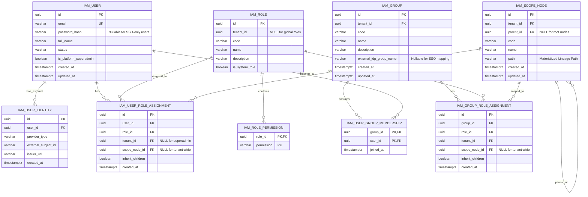
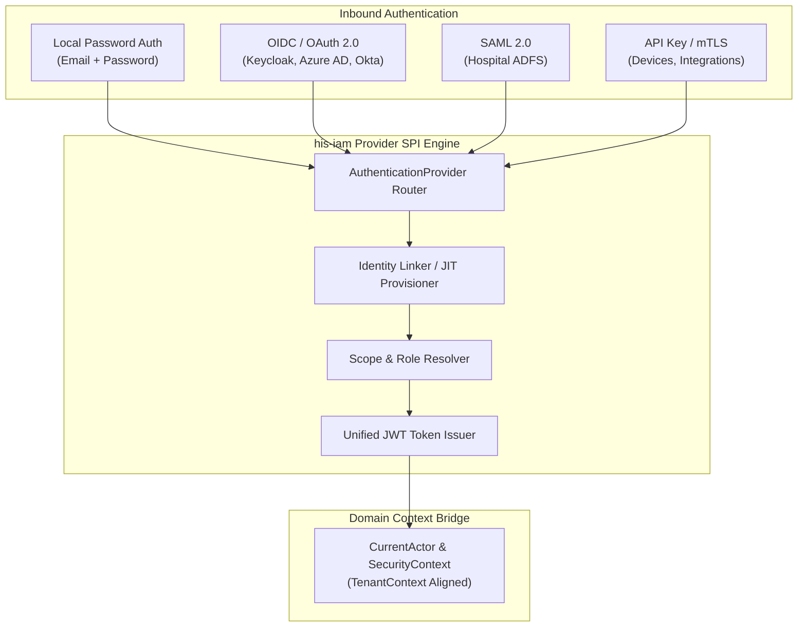

# IAM Plugin Architecture & Implementation Plan

## 1. Overview & Architectural Goals

The **IAM (Identity and Access Management)** module is designed as a **self-contained, pluggable vertical module (`his-iam`)** for Uwati HIS. It provides authentication, role-based access control (RBAC), and hierarchical organizational scoping without tightly coupling the core HIS domain to any specific identity mechanism or provider.

### Key Architectural Goals
1. **Pluggable & Autonomous**: The module encapsulates its own domain models, use cases, REST endpoints, JPA persistence entities, security filters, pluggable authentication providers, and Liquibase database migrations.
2. **Pluggable Authentication Providers (SPI)**: All authentication methods (Local Password, OAuth2/OIDC, SAML 2.0, API Keys) reside internally within `his-iam` behind a common provider interface. Downstream HIS core modules (`his-core`, `his-domain`) depend only on generic security context ports (`CurrentActor`, `SecurityContext`).
3. **Unified Token Bridge**: Regardless of how an actor authenticates (Direct DB, Keycloak, Azure AD, SAML, or API Key), IAM resolves their identity, tenant memberships, group memberships, and hierarchical scopes into a uniform **Uwati Session Token (JWT)**. Downstream services remain completely provider-agnostic.
4. **Global Identity with Multi-Tenant Memberships**: Supports both global **Platform Superadmins** (cross-tenant operators) and **Tenant-Scoped Users** who belong to one or more tenant organizations.
5. **Tenant User Groups & Federated IdP Sync**: Supports tenant-level User Groups/Teams for bulk role and scope assignment, with automatic Just-In-Time (JIT) synchronization from external IdP group claims (e.g., Azure AD / Okta / Keycloak groups).
6. **Generic Hierarchical Scope Tree (Organizational Units)**: Supports arbitrary-depth organizational structures (Company $\rightarrow$ Division $\rightarrow$ Sub-Division $\rightarrow$ Department $\rightarrow$ Unit) with automatic downward subtree inheritance, without rigid or hardcoded level types.
7. **Zero-Configuration Inclusion**: Discovered and enabled via Spring Boot Auto-Configuration when the artifact is added to the application classpath.

---

## 2. System Architecture & Module Boundaries

Dependencies point inwards or to shared core contracts. HIS business logic remains transport- and security-vendor-agnostic.

```
┌─────────────────────────────────────────────────────────────────────────┐
│                              his-bootstrap                              │
│         (Wires applications, imports plugins, starts server)            │
└────────────────────┬───────────────────────────────┬────────────────────┘
                     │                               │
┌────────────────────▼──────────────────┐ ┌──────────▼──────────────────┐
│            his-iam (Plugin)           │ │      his-core & adapters    │
│  ┌─────────────────────────────────┐  │ │  - Patient, Clinical, etc.  │
│  │ Pluggable Auth Providers (SPI)  │  │ │  - Pure domain rules        │
│  │ ├─ Local DB (Email + Password)  │  │ │  - Consumes CurrentActor    │
│  │ ├─ OIDC (Keycloak, Azure AD)    │  │ │    from SecurityContext     │
│  │ ├─ SAML 2.0 (Hospital ADFS)     │  │ │                             │
│  │ └─ API Key (M2M / Lab Devices)  │  │ │                             │
│  └────────────────┬────────────────┘  │ │                             │
│                   ▼                   │ │                             │
│  ┌─────────────────────────────────┐  │ │                             │
│  │ Unified JWT Token Bridge        │  │ │                             │
│  └─────────────────────────────────┘  │ │                             │
│  - REST: /api/v1/auth, /iam           │ │                             │
│  - Scope Hierarchy & RBAC Engine      │ │                             │
│  - Migrations: db/changelog/iam/*     │ │                             │
└────────────────────┬──────────────────┘ └──────────┬──────────────────┘
                     │                               │
                     └───────────────┬───────────────┘
                                     ▼
                     ┌───────────────────────────────┐
                     │          his-domain           │
                     │  - TenantContext              │
                     │  - SecurityContext Port       │
                     │  - Auditable                  │
                     └───────────────────────────────┘
```

---

## 3. Domain & Data Model

### 3.1 Entity Relationship Diagram



---

### 3.2 Database Schema Definitions

```sql
-- 1. Global User Accounts & Identities
CREATE TABLE iam_user (
    id UUID PRIMARY KEY,
    email VARCHAR(255) NOT NULL UNIQUE,
    password_hash VARCHAR(255),          -- NULL if user authenticates solely via external IdP
    full_name VARCHAR(255) NOT NULL,
    status VARCHAR(32) NOT NULL DEFAULT 'ACTIVE', -- ACTIVE, SUSPENDED, DEACTIVATED
    is_platform_superadmin BOOLEAN NOT NULL DEFAULT FALSE,
    created_at TIMESTAMP WITH TIME ZONE NOT NULL,
    updated_at TIMESTAMP WITH TIME ZONE NOT NULL
);

-- 2. Federated External Identities (OIDC / OAuth2 / SAML)
CREATE TABLE iam_user_identity (
    id UUID PRIMARY KEY,
    user_id UUID NOT NULL REFERENCES iam_user(id) ON DELETE CASCADE,
    provider_type VARCHAR(32) NOT NULL,  -- 'LOCAL', 'OIDC_KEYCLOAK', 'OIDC_AZURE', 'SAML_ADFS'
    external_subject_id VARCHAR(255) NOT NULL, -- sub claim or NameID from external IdP
    issuer_url VARCHAR(512),             -- IdP realm or issuer URL
    created_at TIMESTAMP WITH TIME ZONE NOT NULL,
    CONSTRAINT uk_iam_identity_provider UNIQUE (provider_type, external_subject_id)
);
CREATE INDEX idx_iam_identity_user ON iam_user_identity(user_id);

-- 3. Tenant User Groups (Teams / Cohorts / SSO Mappings)
CREATE TABLE iam_group (
    id UUID PRIMARY KEY,
    tenant_id UUID NOT NULL,
    code VARCHAR(64) NOT NULL,
    name VARCHAR(255) NOT NULL,
    description TEXT,
    external_idp_group_name VARCHAR(255), -- For automatic JIT sync with OIDC/SAML group claims
    created_at TIMESTAMP WITH TIME ZONE NOT NULL,
    updated_at TIMESTAMP WITH TIME ZONE NOT NULL,
    CONSTRAINT uk_iam_group_tenant_code UNIQUE (tenant_id, code)
);
CREATE INDEX idx_iam_group_tenant ON iam_group(tenant_id);

-- 4. User-Group Memberships (Many-to-Many)
CREATE TABLE iam_user_group_membership (
    group_id UUID NOT NULL REFERENCES iam_group(id) ON DELETE CASCADE,
    user_id UUID NOT NULL REFERENCES iam_user(id) ON DELETE CASCADE,
    joined_at TIMESTAMP WITH TIME ZONE NOT NULL,
    PRIMARY KEY (group_id, user_id)
);
CREATE INDEX idx_iam_ugm_user ON iam_user_group_membership(user_id);

-- 5. Roles
CREATE TABLE iam_role (
    id UUID PRIMARY KEY,
    tenant_id UUID,                     -- NULL for system/global roles
    code VARCHAR(64) NOT NULL,          -- e.g. 'ADMIN', 'PHYSICIAN', 'DEPT_MANAGER'
    name VARCHAR(255) NOT NULL,
    description TEXT,
    is_system_role BOOLEAN NOT NULL DEFAULT FALSE,
    created_at TIMESTAMP WITH TIME ZONE NOT NULL,
    updated_at TIMESTAMP WITH TIME ZONE NOT NULL,
    CONSTRAINT uk_iam_role_tenant_code UNIQUE (tenant_id, code)
);

-- 6. Role Permissions
CREATE TABLE iam_role_permission (
    role_id UUID NOT NULL REFERENCES iam_role(id) ON DELETE CASCADE,
    permission VARCHAR(64) NOT NULL,    -- e.g. 'PATIENT_READ', 'MEDICINE_WRITE'
    PRIMARY KEY (role_id, permission)
);

-- 7. Generic Hierarchical Scope Tree (Organizational Units)
CREATE TABLE iam_scope_node (
    id UUID PRIMARY KEY,
    tenant_id UUID NOT NULL,
    parent_id UUID REFERENCES iam_scope_node(id) ON DELETE RESTRICT,
    code VARCHAR(64) NOT NULL,
    name VARCHAR(255) NOT NULL,
    path VARCHAR(512) NOT NULL,          -- e.g. '/<tenant_id>/<node_1_id>/<node_2_id>/'
    created_at TIMESTAMP WITH TIME ZONE NOT NULL,
    updated_at TIMESTAMP WITH TIME ZONE NOT NULL,
    CONSTRAINT uk_iam_scope_node_tenant_code UNIQUE (tenant_id, code)
);
CREATE INDEX idx_iam_scope_node_path ON iam_scope_node(path varchar_pattern_ops);
CREATE INDEX idx_iam_scope_node_tenant ON iam_scope_node(tenant_id);

-- 8. Direct User Role & Scope Assignments
CREATE TABLE iam_user_role_assignment (
    id UUID PRIMARY KEY,
    user_id UUID NOT NULL REFERENCES iam_user(id) ON DELETE CASCADE,
    role_id UUID NOT NULL REFERENCES iam_role(id) ON DELETE CASCADE,
    tenant_id UUID,                     -- NULL for platform superadmin
    scope_node_id UUID REFERENCES iam_scope_node(id) ON DELETE CASCADE, -- NULL = tenant-wide
    inherit_children BOOLEAN NOT NULL DEFAULT TRUE,
    created_at TIMESTAMP WITH TIME ZONE NOT NULL
);
CREATE INDEX idx_iam_user_assignment ON iam_user_role_assignment(user_id, tenant_id);

-- 9. Group Role & Scope Assignments
CREATE TABLE iam_group_role_assignment (
    id UUID PRIMARY KEY,
    group_id UUID NOT NULL REFERENCES iam_group(id) ON DELETE CASCADE,
    role_id UUID NOT NULL REFERENCES iam_role(id) ON DELETE CASCADE,
    tenant_id UUID NOT NULL,
    scope_node_id UUID REFERENCES iam_scope_node(id) ON DELETE CASCADE, -- NULL = tenant-wide
    inherit_children BOOLEAN NOT NULL DEFAULT TRUE,
    created_at TIMESTAMP WITH TIME ZONE NOT NULL
);
CREATE INDEX idx_iam_group_assignment ON iam_group_role_assignment(group_id, tenant_id);
```

---

## 4. Hierarchical Scope Tree & Subtree Inheritance

### 4.1 Concept & Mechanics
To prevent rigid taxonomies (like hardcoded division/department enumerations), every organizational unit is modeled as a generic **Scope Node**.

- **Root Level**: Represents a top-level facility or headquarters branch under the tenant.
- **Intermediate Nodes**: Divisions, wings, departments, or clinical units at arbitrary nesting depth.
- **Subtree Inheritance (`path`)**:
  - The `path` field stores the materialized ancestry path (e.g. `/<tenant_id>/<node_A_id>/<node_B_id>/`).
  - When a user is assigned a role at Node $A$ with `inherit_children = true`, their effective scope includes Node $A$ and **all nodes whose path starts with Node $A$'s path**.

### 4.2 Subtree Resolution Example

```
Tenant: City Health System (ID: T-100)
├── [Node A] Medical Services Division (Path: /T-100/A/)
│     ├── [Node B] Surgical Sub-Division (Path: /T-100/A/B/)
│     │     ├── [Node C] General Surgery Dept (Path: /T-100/A/B/C/)
│     │     └── [Node D] Orthopedics Dept (Path: /T-100/A/B/D/)
│     └── [Node E] Internal Medicine Sub-Division (Path: /T-100/A/E/)
│           └── [Node F] Cardiology Dept (Path: /T-100/A/E/F/)
└── [Node G] Operations Division (Path: /T-100/G/)
      └── [Node H] Central Pharmacy (Path: /T-100/G/H/)
```

1. **CEO (Tenant-wide)**: Assigned at `scope_node_id = NULL` $\rightarrow$ Allowed scopes: **All Nodes**.
2. **Head of Medicine**: Assigned at `Node A` $\rightarrow$ Allowed scopes: **Nodes A, B, C, D, E, F**.
3. **Surgical Director**: Assigned at `Node B` $\rightarrow$ Allowed scopes: **Nodes B, C, D**.
4. **Cardiology Lead**: Assigned at `Node F` $\rightarrow$ Allowed scopes: **Node F only**.

---

## 5. Pluggable Authentication Architecture

### 5.1 The Pluggable Provider SPI Pattern

Inside `his-iam`, authentication is structured as a pluggable strategy. The authentication use case delegates to registered `AuthenticationProvider` implementations:



#### Provider Interface Contract
```java
package io.github.edmaputra.uwati.iam.application.port.out;

public interface AuthenticationProvider {
    /** Identifies if this provider handles the credential type */
    boolean supports(AuthCredentialType credentialType);

    /** Verifies credentials against local DB or external IdP */
    AuthenticatedIdentity authenticate(AuthCredentials credentials);
}
```

### 5.2 Supported Provider Implementations (All Internal to `his-iam`)

1. **`LocalPasswordAuthProvider` (Baseline)**:
   - Authenticates email and password against `iam_user` using `BCryptPasswordEncoder`.
   - Ideal for standalone setups, local deployments, and **Platform Superadmin emergency access**.
2. **`OidcAuthProvider` (Enterprise SSO)**:
   - Validates OpenID Connect ID tokens / authorization codes from Keycloak, Azure AD, Okta, or Google Workspace.
   - Automatically performs Just-In-Time (JIT) user account linking via `iam_user_identity`.
   - Synchronizes external group claims (e.g. `groups` / `roles` claim in ID token) with `iam_group` entities configured with matching `external_idp_group_name`.
3. **`SamlAuthProvider` (Hospital Federation)**:
   - Consumes SAML 2.0 assertions from enterprise ADFS or national health federations.
   - Maps SAML Attribute Statements to tenant group memberships via `iam_group.external_idp_group_name`.
4. **`ApiKeyAuthProvider` (Machine-to-Machine / M2M)**:
   - Validates `X-API-Key` headers for automated lab devices, radiology systems, or ETL sync jobs.

### 5.3 Unified JWT Token Bridge
Once any provider successfully validates an identity:
1. IAM loads the user's direct role assignments and their **group-inherited role assignments** (`iam_group_role_assignment`).
2. IAM calculates effective union of roles, permissions, and scope paths:
   $$\text{Effective Roles} = \text{Direct User Roles} \cup \bigcup_{g \in \text{User Groups}} \text{Group Roles}$$
   $$\text{Effective Scopes} = \text{Direct Scope Paths} \cup \bigcup_{g \in \text{User Groups}} \text{Group Scope Paths}$$
3. IAM issues a standard, signed **Uwati Access Token (JWT)** and **Refresh Token**.
4. **JWT Payload Structure**:
   ```json
   {
     "sub": "b2c9a101-7b08-4122-83b3-b5413cf4a401",
     "email": "doctor.alice@hospital.org",
     "tenantId": "c4d28e77-502a-4299-8cfb-665a3962b112",
     "isSuperAdmin": false,
     "groups": ["CARDIOLOGY_TEAM", "ON_CALL_FELLOWS"],
     "roles": ["PHYSICIAN", "DEPT_MANAGER"],
     "permissions": ["PATIENT_READ", "PRESCRIPTION_CREATE", "MEDICAL_RECORD_WRITE"],
     "scopeNodeIds": ["a1b2c3d4-0000-0000-0000-000000000001", "a1b2c3d4-0000-0000-0000-000000000002"],
     "scopePaths": ["/c4d28e77/a1b2c3d4/"],
     "exp": 1740000000
   }
   ```
5. **Security Filter & Context Bridge**:
   - `JwtAuthenticationFilter` intercepts HTTP requests.
   - Validates signature and expiration.
   - Populates `SecurityContext` with a `CurrentActor` instance.
   - Synchronizes `TenantContext` to match the validated tenant claim.

### 5.4 The `CurrentActor` Port Definition (in `his-domain`)

```java
package io.github.edmaputra.uwati.domain.security;

import java.util.Set;
import java.util.UUID;

public interface CurrentActor {
    UUID userId();
    String email();
    UUID tenantId();
    boolean isPlatformSuperAdmin();
    boolean isTenantWide();
    Set<String> groups();
    Set<String> roles();
    Set<String> permissions();
    boolean hasPermission(String permission);
    boolean canAccessScope(UUID targetScopeNodeId);
    Set<UUID> accessibleScopeNodeIds();
}
```

---

## 6. Directory & Package Structure

The `his-iam` module is organized internally using clean/hexagonal conventions:

```
his-iam/
├── pom.xml
└── src/
    ├── main/
    │   ├── java/io/github/edmaputra/uwati/iam/
    │   │   ├── IamAutoConfiguration.java
    │   │   ├── domain/
    │   │   │   ├── model/ (User, Role, ScopeNode, UserRoleAssignment, UserIdentity, Group, UserGroupMembership, GroupRoleAssignment)
    │   │   │   └── exception/ (AuthenticationException, AccessDeniedException)
    │   │   ├── application/
    │   │   │   ├── port/in/ (AuthenticateUserUseCase, ManageUserUseCase, ManageScopeUseCase, ManageGroupUseCase)
    │   │   │   ├── port/out/ (UserRepository, RoleRepository, ScopeNodeRepository, GroupRepository, PasswordEncoderPort)
    │   │   │   └── service/ (AuthenticationService, ScopeHierarchyService, UserService, GroupService)
    │   │   └── adapter/
    │   │       ├── rest/
    │   │       │   ├── AuthController.java
    │   │       │   ├── UserController.java
    │   │       │   ├── ScopeNodeController.java
    │   │       │   ├── RoleController.java
    │   │       │   ├── GroupController.java
    │   │       │   └── dto/ (LoginRequest, TokenResponse, CreateScopeRequest, CreateGroupRequest, etc.)
    │   │       ├── persistence/
    │   │       │   ├── entity/ (UserJpaEntity, RoleJpaEntity, ScopeNodeJpaEntity, UserIdentityJpaEntity, GroupJpaEntity, GroupRoleAssignmentJpaEntity, UserGroupMembershipJpaEntity)
    │   │       │   ├── repository/ (SpringDataUserRepository, SpringDataScopeNodeRepository, SpringDataGroupRepository)
    │   │       │   └── adapter/ (UserRepositoryAdapter, ScopeNodeRepositoryAdapter, GroupRepositoryAdapter)
    │   │       └── security/
    │   │           ├── provider/
    │   │           │   ├── AuthenticationProvider.java
    │   │           │   ├── LocalPasswordAuthProvider.java
    │   │           │   ├── OidcAuthProvider.java
    │   │           │   ├── SamlAuthProvider.java
    │   │           │   └── ApiKeyAuthProvider.java
    │   │           ├── jwt/
    │   │           │   ├── JwtTokenProvider.java
    │   │           │   └── JwtAuthenticationFilter.java
    │   │           ├── BCryptPasswordEncoderAdapter.java
    │   │           └── SecurityContextAccessor.java
    │   └── resources/
    │       ├── META-INF/spring/org.springframework.boot.autoconfigure.AutoConfiguration.imports
    │       └── db/changelog/iam/
    │           ├── 2026082601-create-iam-tables.json
    │           └── db.changelog-iam.json
    └── test/
        └── java/io/github/edmaputra/uwati/iam/
            ├── domain/
            ├── application/
            ├── adapter/
            └── integration/
```

---

## 7. REST API Endpoints Specification & Entity Management

### 7.1 Authentication Endpoints (`/api/v1/auth`)
- `POST /api/v1/auth/login`: Authenticate with credentials (email/password or SSO token) and obtain access & refresh tokens.
- `POST /api/v1/auth/refresh`: Exchange refresh token for a new access token.
- `GET /api/v1/auth/me`: Retrieve currently authenticated user profile, roles, permissions, group memberships, and accessible scopes.

### 7.2 Scope Tree Management Endpoints (`/api/v1/iam/scopes`)
- `GET /api/v1/iam/scopes`: Fetch full hierarchical scope tree or flat list for the active tenant.
- `POST /api/v1/iam/scopes`: Create a new scope node (`code`, `name`, optional `parentId`). Automatically calculates materialized `path`.
- `GET /api/v1/iam/scopes/{id}`: Retrieve scope node details along with direct child nodes.
- `PUT /api/v1/iam/scopes/{id}`: Update node metadata (`name`, `code`).
- `PUT /api/v1/iam/scopes/{id}/parent`: Move / re-parent node to a new parent. Automatically cascades materialized `path` updates to all descendants.
- `DELETE /api/v1/iam/scopes/{id}`: Delete a node.
  - *Safeguard*: Rejects deletion with `409 Conflict` if the node has child nodes or active user/group role assignments.

### 7.3 Role & Permission Endpoints (`/api/v1/iam/roles`)
- `GET /api/v1/iam/roles`: List available roles (supports `?type=ALL|SYSTEM|CUSTOM`).
- `POST /api/v1/iam/roles`: Create a custom tenant role with a specified permission set.
- `GET /api/v1/iam/roles/{id}`: Retrieve role details and assigned permission codes.
- `PUT /api/v1/iam/roles/{id}`: Update role name, description, and permission set.
  - *Safeguard*: System roles (`is_system_role = true`) are immutable and cannot be updated.
- `DELETE /api/v1/iam/roles/{id}`: Delete a custom role.
  - *Safeguard*: Rejects deletion if the role is a system role or is currently assigned to any active user or group.
- `GET /api/v1/iam/permissions`: List all registered system permissions grouped by domain category (e.g., `PATIENT`, `CLINICAL`, `BILLING`, `IAM`).

### 7.4 User Lifecycle & Direct Assignment Endpoints (`/api/v1/iam/users`)
- `GET /api/v1/iam/users`: Paginated search and filtering of users:
  - Query parameters: `?page=0&size=20&search=keyword&status=ACTIVE|SUSPENDED|DEACTIVATED&roleId=...&groupId=...&scopeNodeId=...`
- `POST /api/v1/iam/users`: Register/provision a new user with initial profile and optional role/group assignments.
- `GET /api/v1/iam/users/{id}`: Retrieve complete user profile, linked identities, direct roles, group memberships, and status.
- `PUT /api/v1/iam/users/{id}`: Update user profile (`fullName`, contact info).
- `PATCH /api/v1/iam/users/{id}/status`: Transition user lifecycle state (`ACTIVE`, `SUSPENDED`, `DEACTIVATED`).
- `PUT /api/v1/iam/users/{id}/password`: Update/reset user password (hashes using BCrypt; invalidates existing refresh tokens).
- `DELETE /api/v1/iam/users/{id}`: Deactivate user (soft delete).
  - *Safeguard*: Hard deletion is disallowed if foreign audit logs or clinical transactions reference the user ID.
- `GET /api/v1/iam/users/{id}/effective-access`: Diagnostic endpoint returning the compiled, flattened access snapshot:
  - Combined direct + group-inherited roles.
  - Flattened distinct permissions.
  - All accessible scope node IDs and materialized paths.
- `GET /api/v1/iam/users/{id}/identities`: List federated SSO/OAuth2/SAML identities linked to the user.
- `DELETE /api/v1/iam/users/{id}/identities/{identityId}`: Unlink an external IdP account.
- `GET /api/v1/iam/users/{userId}/assignments`: List direct role-to-scope assignments for the user.
- `POST /api/v1/iam/users/{userId}/assignments`: Assign a role at a target scope node (`roleId`, optional `scopeNodeId`, `inheritChildren`).
- `DELETE /api/v1/iam/users/{userId}/assignments/{assignmentId}`: Revoke a direct role assignment.

### 7.5 User Group & Team Management Endpoints (`/api/v1/iam/groups`)
- `GET /api/v1/iam/groups`: Paginated list of groups in active tenant (`?page=0&size=20&search=...`).
- `POST /api/v1/iam/groups`: Create a new group (specifying `code`, `name`, `description`, optional `externalIdpGroupName`).
- `GET /api/v1/iam/groups/{groupId}`: Get group details with summary statistics.
- `PUT /api/v1/iam/groups/{groupId}`: Update group metadata and SSO mapping name.
- `DELETE /api/v1/iam/groups/{groupId}`: Delete a group (automatically cascades removal of memberships and group assignments).
- `GET /api/v1/iam/groups/{groupId}/members`: Paginated list of active users in the group.
- `POST /api/v1/iam/groups/{groupId}/members`: Add users to group (supports batch user ID array).
- `DELETE /api/v1/iam/groups/{groupId}/members/{userId}`: Remove user from group.
- `GET /api/v1/iam/groups/{groupId}/assignments`: List role-to-scope assignments assigned to the group.
- `POST /api/v1/iam/groups/{groupId}/assignments`: Assign a role to the group at a target scope node (`roleId`, optional `scopeNodeId`, `inheritChildren`).
- `DELETE /api/v1/iam/groups/{groupId}/assignments/{assignmentId}`: Revoke a group role assignment.

---

## 8. Business Rules, Safeguards & Domain Events

### 8.1 User Lifecycle State Machine
```
[Provisioned / JIT] ──► ACTIVE ◄────► SUSPENDED
                           │
                           ▼
                      DEACTIVATED (Soft Deleted)
```
- **ACTIVE**: Normal access, can authenticate and obtain JWTs.
- **SUSPENDED**: Temporarily locked (e.g. pending investigation or contract pause). Authentication rejected with `403 Account Suspended`.
- **DEACTIVATED**: Offboarded user. Credentials and refresh tokens permanently revoked. Historical records and audit trail preserved.

### 8.2 Scope Hierarchy Integrity & Path Cascading
- When a node with path `/T-100/A/B/` is moved under parent `C` (`/T-100/C/`), its new path becomes `/T-100/C/B/`.
- The `ScopeHierarchyService` executes a batch prefix update on all descendant nodes (`UPDATE iam_scope_node SET path = replace(path, '/T-100/A/B/', '/T-100/C/B/') WHERE path LIKE '/T-100/A/B/%'`).

### 8.3 Domain Events & Audit Integration
All mutating IAM operations publish Spring application events to decouple side-effects (e.g. cache invalidation, notification, security telemetry) and implement the `Auditable` contract:
- **User Events**: `UserCreatedEvent`, `UserUpdatedEvent`, `UserStatusChangedEvent`, `UserPasswordResetEvent`, `UserDeactivatedEvent`.
- **Role Events**: `RoleCreatedEvent`, `RoleUpdatedEvent`, `RoleDeletedEvent`.
- **Scope Events**: `ScopeNodeCreatedEvent`, `ScopeNodeUpdatedEvent`, `ScopeNodeMovedEvent`, `ScopeNodeDeletedEvent`.
- **Group & Assignment Events**: `GroupCreatedEvent`, `GroupUpdatedEvent`, `GroupDeletedEvent`, `GroupMembershipChangedEvent`, `RoleAssignmentCreatedEvent`, `RoleAssignmentRevokedEvent`.

---

## 9. Implementation Roadmap

### Phase 1: Module Scaffolding & Data Model
1. Create `his-iam` Maven module and register in parent `pom.xml`.
2. Write Liquibase migration `db/changelog/iam/2026082601-create-iam-tables.json` with user, identity, group, user_group_membership, role, permission, scope node, and assignment tables.
3. Configure Liquibase modular changelog discovery.
4. Implement pure domain models: `User`, `UserIdentity`, `Group`, `UserGroupMembership`, `Role`, `Permission`, `ScopeNode`, `UserRoleAssignment`, `GroupRoleAssignment`.
5. Implement domain events and `Auditable` mappings.

### Phase 2: Hierarchical Scope Tree & Subtree Resolver
1. Implement `ScopeNode` path generation and re-parenting cascade algorithms.
2. Implement `ScopeHierarchyService` to compute descendant subtree sets efficiently.
3. Write comprehensive unit tests for tree traversal, moves, and inheritance verification.

### Phase 3: Pluggable Authentication & Security Filter
1. Implement `AuthenticationProvider` SPI and `LocalPasswordAuthProvider` with `BCrypt`.
2. Implement JWT token provider (sign, parse, claims builder with scope paths and group memberships).
3. Implement `JwtAuthenticationFilter` and `SecurityContext` / `CurrentActor` port bridge.
4. Implement `AuthenticateUserUseCase` and `/api/v1/auth/*` endpoints (`/login`, `/refresh`, `/me`).

### Phase 4: Scoped RBAC, Groups & Comprehensive Management CRUD
1. Implement application use cases and services:
   - `ManageUserUseCase` (CRUD, status changes, password management, effective access calculation).
   - `ManageGroupUseCase` (CRUD, batch membership management, group assignments).
   - `ManageRoleUseCase` (CRUD, permission catalog, immutability guards).
   - `ManageScopeUseCase` (CRUD, tree queries, re-parenting).
2. Implement REST controllers: `UserController`, `GroupController`, `RoleController`, `ScopeNodeController`.
3. Add request validation, error responses (`ProblemDetail` / global exception handlers), and pagination support.

### Phase 5: Verification & Integration Testing
1. Add integration tests using Testcontainers (PostgreSQL).
2. Verify token generation, tenant context propagation, and scope tree filtering (including group inheritance and effective access calculation).
3. Verify modular auto-configuration when consumed from `his-bootstrap`.
