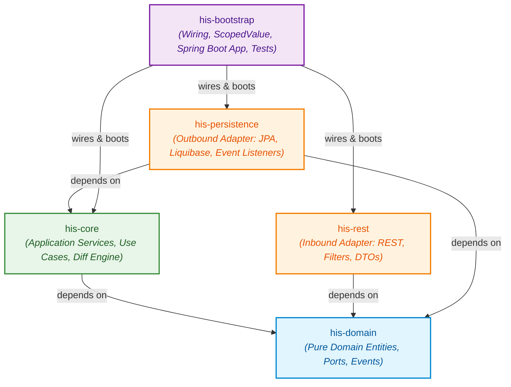
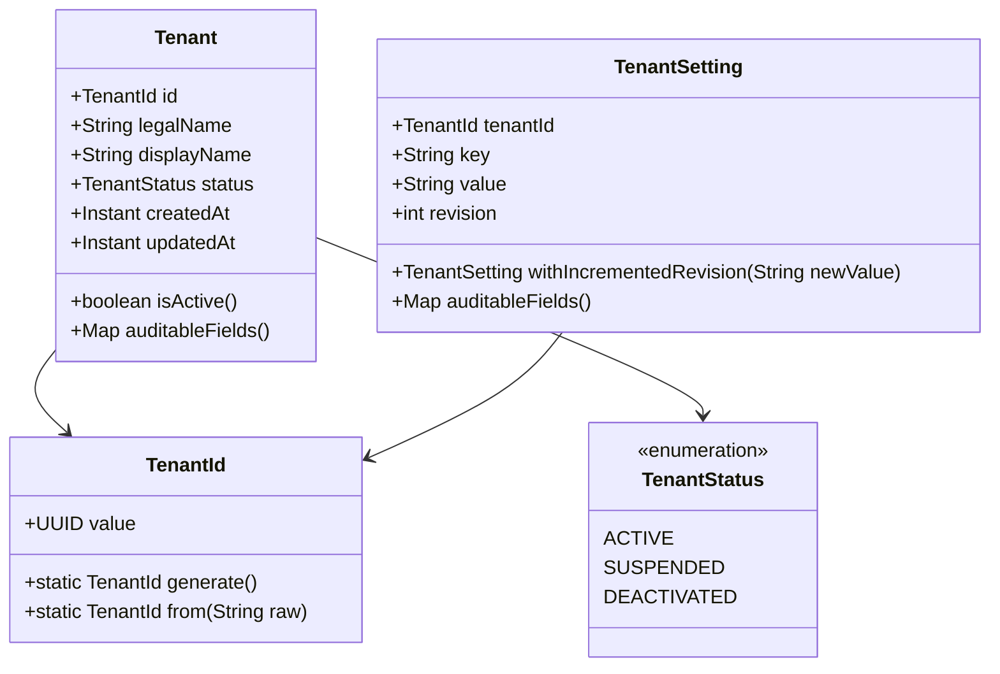
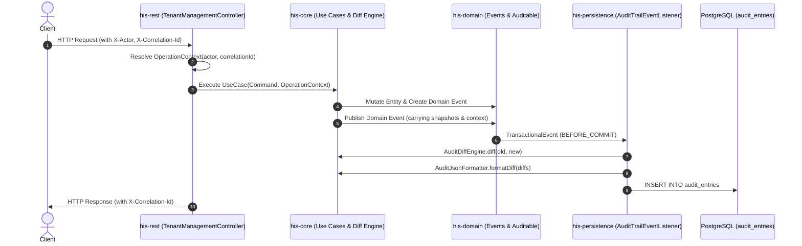
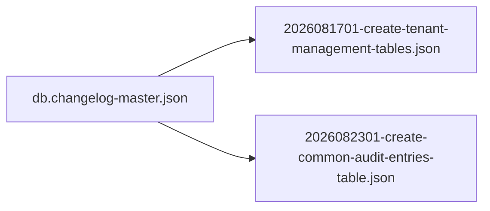
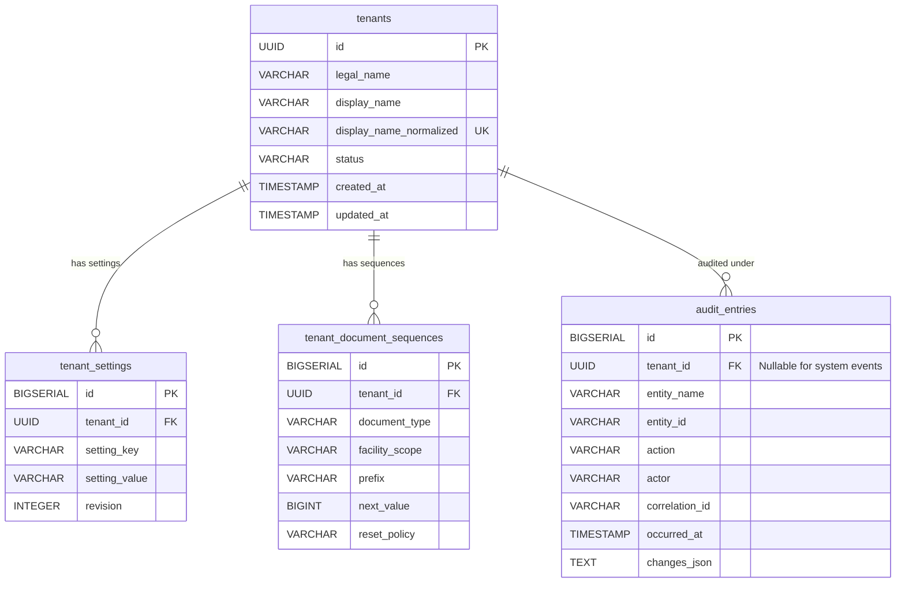
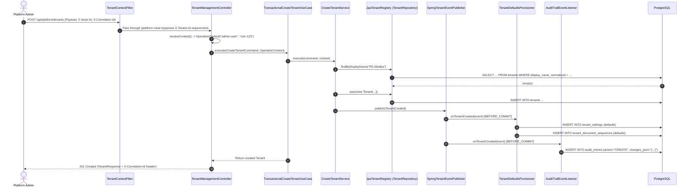
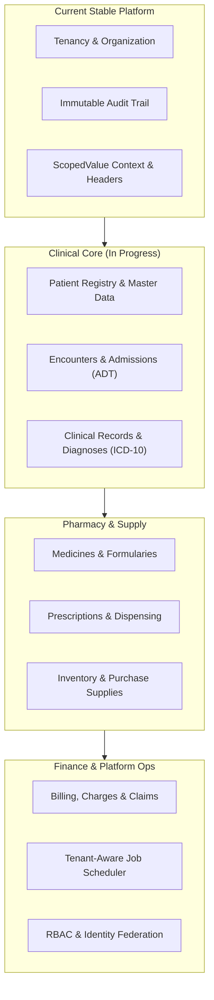

# Uwati HIS: Complete Project Walkthrough

This document provides a comprehensive technical walkthrough of the **Uwati Hospital Information System (HIS)** backend platform. It serves as the primary architectural reference, onboarding guide, and operational blueprint for engineers and contributors.

---

## Table of Contents

1. [Executive Summary & System Vision](#1-executive-summary--system-vision)
2. [Multi-Module Hexagonal Architecture](#2-multi-module-hexagonal-architecture)
   - [Module Responsibilities & Boundaries](#module-responsibilities--boundaries)
   - [Strict Inward Dependency Rule](#strict-inward-dependency-rule)
3. [Core Architectural Pillars](#3-core-architectural-pillars)
   - [Multi-Tenancy Subsystem](#multi-tenancy-subsystem)
   - [Immutable Audit Trail Subsystem](#immutable-audit-trail-subsystem)
   - [Modern Java 25 & Hexagonal Principles](#modern-java-25--hexagonal-principles)
4. [Database Schema & Liquibase Migrations](#4-database-schema--liquibase-migrations)
   - [Migration Sequence](#migration-sequence)
   - [Schema Tables & Relationships](#schema-tables--relationships)
5. [API Surface & End-to-End Request Lifecycle](#5-api-surface--end-to-end-request-lifecycle)
   - [REST Endpoints](#rest-endpoints)
   - [Context Headers & Resolution](#context-headers--resolution)
   - [Error Handling (RFC 7807)](#error-handling-rfc-7807)
   - [End-to-End Request Sequence](#end-to-end-request-sequence)
6. [Developer & Operational Guide](#6-developer--operational-guide)
   - [Prerequisites & Tooling](#prerequisites--tooling)
   - [Running Locally with Docker Compose](#running-locally-with-docker-compose)
   - [Building & Testing](#building--testing)
   - [Step-by-Step: Adding a New Domain Aggregate](#step-by-step-adding-a-new-domain-aggregate)
7. [HIS Modernization & Domain Roadmap](#7-his-modernization--domain-roadmap)
8. [Documentation Suite Index](#8-documentation-suite-index)

---

## 1. Executive Summary & System Vision

**Uwati HIS** is an enterprise-grade, multi-tenant backend platform engineered for hospitals, medical centers, and clinical facilities. Modernizing from legacy monolithic clinic software, Uwati HIS is architected as a **backend-first, transport-agnostic, multi-module system** driven by **Domain-Driven Design (DDD)** and **Hexagonal Architecture (Ports and Adapters)**.

### Core Architectural Decisions

- **Hexagonal Architecture**: Absolute decoupling of business domain models and use cases from database drivers, frameworks, web frameworks, and third-party transports.
- **Multi-Tenant by Design**: Native tenant isolation enforced at the domain, application, and persistence layers using a shared-database, discriminator-column model.
- **Explicit Immutable Audit Trail**: Deterministic state diffing capturing *who*, *when*, *which correlation trace*, and *exact JSON differences* across auditable business entities.
- **English-Only Contracts**: Unified, standardized English terminology across all domain entities, REST APIs, and database schemas.
- **Cutting-Edge Java & Spring Ecosystem**: Built on **Java 25** (leveraging `ScopedValue`, records, pattern matching) and **Spring Boot 4.1.0** with PostgreSQL 17 and Liquibase.

---

## 2. Multi-Module Hexagonal Architecture

The codebase is organized into five specialized Maven modules, enforcing strict boundaries where core business logic remains independent of external dependencies.



### Module Responsibilities & Boundaries

| Module | Classification | Primary Responsibilities | External Dependencies |
|---|---|---|---|
| **`his-domain`** | **Core Domain Layer** | Pure business models, immutability rules, domain invariants, value objects (`TenantId`), domain events (`TenantCreated`), inbound/outbound port interfaces, and the `Auditable` contract. | **None** (Pure standard Java 25 library). |
| **`his-core`** | **Application Layer** | Application use case implementations (`CreateTenantService`, `ConfigureTenantSettingsService`, `GetTenantSettingsService`), business orchestration, in-memory `AuditDiffEngine`, and `AuditJsonFormatter`. | `his-domain`, Jackson Databind, Lombok. |
| **`his-rest`** | **Inbound Transport Adapter** | HTTP REST endpoints (`TenantManagementController`), request/response DTO mappings, `TenantContextFilter` (request header scoping), `RestExceptionHandler` (RFC 7807 `ProblemDetail`). | `his-domain`, Spring Boot Starter WebMVC, Lombok. |
| **`his-persistence`** | **Outbound Storage Adapter** | JPA entity mappings (`TenantEntity`, `TenantSettingEntity`, `AuditEntryEntity`), Spring Data repositories, Liquibase schema changesets, transactional event listeners (`TenantDefaultsProvisioner`, `AuditTrailEventListener`). | `his-domain`, `his-core`, Spring Boot Starter Data JPA, Liquibase, PostgreSQL JDBC driver, Lombok. |
| **`his-bootstrap`** | **Infrastructure & Composition** | Spring Boot main application class (`UwatiApplication`), Java 25 `ScopedValueTenantContext`, transactional use case wrappers, Liquibase bean wiring, Testcontainers integration tests. | `his-core`, `his-rest`, `his-persistence`, Spring Boot Starter Actuator, Spring Boot Testcontainers, PostgreSQL Testcontainer. |

### Strict Inward Dependency Rule

> [!IMPORTANT]
> 1. **`his-domain` NEVER imports from any other module or framework.** No Spring, no JPA, no Jackson.
> 2. **`his-core` NEVER imports from adapters (`his-rest` or `his-persistence`).**
> 3. Adapters communicate with the domain and application layer solely via **Inbound Ports** (Use Cases) and **Outbound Ports** (Repositories, Event Publishers).
> 4. Transactions are configured on delegating decorators in `his-bootstrap` or through event listener boundaries, keeping core use cases pure and independently testable without a Spring context.

---

## 3. Core Architectural Pillars

### Multi-Tenancy Subsystem

Uwati HIS enforces strict multi-tenancy at every layer. Every customer organization operates as an isolated tenant within a shared application and shared database.



#### Key Tenancy Mechanisms:

1. **Strongly Typed `TenantId`**: Encapsulates a UUID; rejects nulls or invalid formats at construction time.
2. **Context Scoping via Java 25 `ScopedValue`**:
   The `ScopedValueTenantContext` component in `his-bootstrap` implements `TenantContextScope`. It uses `java.lang.ScopedValue<TenantId>` to bind the current tenant lexically to the executing thread during synchronous servlet requests, preventing context leakage across thread pools.
3. **Automatic Tenant Bootstrap**:
   When `CreateTenantService` publishes `TenantCreated`, the `TenantDefaultsProvisioner` intercepts the event via `@TransactionalEventListener(phase = TransactionPhase.BEFORE_COMMIT)` and provisions default settings and document sequence counters:
   - `organization.locale` (`en-US`)
   - `organization.time-zone` (`UTC`)
   - `finance.currency` (`USD`)
   - `inventory.measurement-system` (`METRIC`)
   - `features.base-configuration` (`STANDARD`)
   - Document sequences: `PATIENT` (`PAT-`), `ENCOUNTER` (`ENC-`), `PRESCRIPTION` (`RX-`), `PURCHASE` (`PUR-`), `INVOICE` (`INV-`).
4. **Validation & Versioning**:
   Settings are validated against strict formatting rules (`TenantSettingValidator`) and revision counters increment on every mutation.

---

### Immutable Audit Trail Subsystem

Audit logs in Uwati HIS are immutable, structured, and decoupled from persistence transactions.



#### Key Audit Mechanisms:

1. **`Auditable` Contract**:
   Domain records implement `Auditable` to declare explicit field maps to be monitored, excluding transient fields like `updatedAt`:
   ```java
   public interface Auditable {
       Map<String, Object> auditableFields();
   }
   ```
2. **Pure In-Memory `AuditDiffEngine`**:
   Calculates differences between entity states:
   - **Entity Diff**: Generates `{ "fieldName": { "old": ..., "new": ... } }`.
   - **Keyed Collection Diff**: Categorizes elements into `added`, `removed`, and `changed`.
   - **Primitive Collection Diff**: Computes set differences for primitives.
3. **Structured JSON Output via `AuditJsonFormatter`**:
   Serializes flat, readable JSON directly at the root for entities, and grouped under collection keys for nested lists.

---

### Modern Java 25 & Hexagonal Principles

- **Java Records**: Extensively utilized for immutable domain models (`Tenant`, `TenantSetting`), commands (`CreateTenantCommand`), events (`TenantCreated`), and DTOs.
- **Compact Invariants**: Compact constructors enforce non-null requirements, format validation, and logical constraints at instantiation time.
- **Port Interfaces**:
  - Inbound Ports: `CreateTenantUseCase`, `ConfigureTenantSettingsUseCase`, `GetTenantSettingsUseCase`.
  - Outbound Ports: `TenantRepository`, `TenantSettingRepository`, `TenantEventPublisher`.

---

## 4. Database Schema & Liquibase Migrations

Database schema versioning is managed via **Liquibase** under `his-persistence/src/main/resources/db/changelog/`.

### Migration Sequence



1. **`2026081701-create-tenant-management-tables.json`**:
   - Creates `tenants`, `tenant_settings`, `tenant_document_sequences`, and legacy `tenant_audit_entries`.
   - Adds unique constraints on `tenants.display_name_normalized` and `tenant_settings(tenant_id, setting_key)`.
2. **`2026082301-create-common-audit-entries-table.json`**:
   - Introduces unified, platform-wide `audit_entries` table.
   - Drops legacy `tenant_audit_entries`.
   - Provisions query indexes for entity, tenant, correlation ID, and timestamp lookups.

---

### Schema Tables & Relationships



---

## 5. API Surface & End-to-End Request Lifecycle

### REST Endpoints

All tenant management endpoints are platform-level endpoints located under `/api/platform/tenants`:

| Method | Path | Description | Required Headers | Response Status |
|---|---|---|---|---|
| `POST` | `/api/platform/tenants` | Provisions a new customer tenant and seeds default configurations. | `X-Actor-Id` (optional), `X-Correlation-Id` (optional) | `201 Created` |
| `GET` | `/api/platform/tenants/{tenantId}/settings` | Retrieves all active settings and revisions for a tenant. | None | `200 OK` |
| `PUT` | `/api/platform/tenants/{tenantId}/settings` | Modifies or adds tenant settings with incremented revisions and audit logging. | `X-Actor-Id` (optional), `X-Correlation-Id` (optional) | `200 OK` |

#### Tenant-Scoped Business Endpoints (Standard API)

Tenant-scoped endpoints (under `/api/...` excluding `/api/platform/...`) require the `X-Tenant-Id` header. If missing or malformed, the `TenantContextFilter` terminates the request early with a `400 Bad Request`.

---

### Context Headers & Resolution

Incoming HTTP headers are mapped to internal context objects:

| HTTP Header | Precedence / Resolution Order | Resolved Context |
|---|---|---|
| `X-Tenant-Id` | Required for `/api/*` (bypassed for `/api/platform/*`). | `TenantId` in `TenantContextScope` |
| `X-Actor-Id` / `X-Actor` / `X-User-Id` | `X-Actor-Id` → `X-Actor` → `X-User-Id` → Fallback: `"system"` | `OperationContext.actor()` |
| `X-Correlation-Id` / `X-Request-Id` | `X-Correlation-Id` → `X-Request-Id` → Fallback: `UUID.randomUUID()` | `OperationContext.correlationId()` |

> [!NOTE]
> Every response generated by `TenantManagementController` returns the active `X-Correlation-Id` response header for distributed tracing.

---

### Error Handling (RFC 7807)

The `RestExceptionHandler` translates domain exceptions into standard RFC 7807 `ProblemDetail` structures:

| Domain / Application Exception | HTTP Status Code | Example Error Payload |
|---|---|---|
| `TenantNotFoundException` | `404 Not Found` | `{"type": "about:blank", "title": "Not Found", "status": 404, "detail": "Tenant 'b8c3f4e2...' was not found."}` |
| `DuplicateTenantDisplayNameException` | `409 Conflict` | `{"type": "about:blank", "title": "Conflict", "status": 409, "detail": "Tenant with display name 'RS Permata' already exists..."}` |
| `InvalidTenantSettingException` | `400 Bad Request` | `{"type": "about:blank", "title": "Bad Request", "status": 400, "detail": "Invalid timezone 'Invalid/Zone'..."}` |
| `MissingTenantContextException` | `400 Bad Request` | `{"type": "about:blank", "title": "Bad Request", "status": 400, "detail": "A tenant context is required..."}` |

---

### End-to-End Request Sequence

Here is the trace of creating a new tenant:



---

## 6. Developer & Operational Guide

### Prerequisites & Tooling

- **JDK 25** (Ensure `JAVA_HOME` points to Java 25).
- **Docker & Docker Compose** (For running local PostgreSQL 17 or Testcontainers during testing).
- **Maven 3.9+** (or use the included `./mvnw` wrapper).

---

### Running Locally with Docker Compose

Start the local PostgreSQL 17 database instance:

```bash
docker compose up -d
```

Verify that PostgreSQL is healthy:
```bash
docker compose ps
```

Launch the Spring Boot application:
```bash
./mvnw spring-boot:run -pl his-bootstrap
```

The application will automatically execute Liquibase changelogs upon startup and start listening on port `8080`.

---

### Building & Testing

To compile all modules and execute the full test suite (including unit tests, slice tests, and Testcontainers integration tests):

```bash
./mvnw clean verify
```

To run tests only for a specific module:
```bash
# Run persistence and integration tests
./mvnw test -pl his-bootstrap

# Run core audit diff engine tests
./mvnw test -pl his-core
```

---

### Step-by-Step: Adding a New Domain Aggregate

Follow this blueprint when implementing a new HIS domain aggregate (e.g., `Patient`, `Encounter`, `Prescription`):

#### Step 1: Define Domain Models & Ports in `his-domain`
1. Create the entity record in `io.github.edmaputra.uwati.domain.<module>.domain`:
   - Implement `Auditable` to define business fields tracked by audit trails.
   - Include invariants in the compact constructor.
2. Define domain events in `io.github.edmaputra.uwati.domain.<module>.domain.event` (e.g., `PatientRegistered`).
3. Define use case interfaces (Inbound Ports) and repository interfaces (Outbound Ports) in `application.port.in` and `application.port.out`.

```java
// Example: his-domain/.../Patient.java
public record Patient(
    PatientId id,
    TenantId tenantId,
    String mrn,
    String fullName,
    Instant createdAt) implements Auditable {

    @Override
    public Map<String, Object> auditableFields() {
        return Map.of("mrn", mrn, "fullName", fullName);
    }
}
```

#### Step 2: Implement Business Services in `his-core`
1. Implement the inbound use case port in `io.github.edmaputra.uwati.core.<module>.application.service`.
2. Inject outbound repository ports and event publishers via constructor.
3. Accept explicit `OperationContext` for mutating actions and publish domain events.

#### Step 3: Implement Persistence in `his-persistence`
1. Create Liquibase changeset JSON under `src/main/resources/db/changelog/` and include it in `db.changelog-master.json`.
2. Define JPA entity mapping in `adapter.persistence.<module>` ensuring `tenant_id` is present on all tenant-owned records.
3. Implement domain repository port using Spring Data JPA.
4. Add audit handling in `AuditTrailEventListener` to listen to the new domain event:
   ```java
   @TransactionalEventListener(phase = TransactionPhase.BEFORE_COMMIT)
   public void onPatientRegistered(PatientRegistered event) {
       Map<String, FieldDiff> diffs = AuditDiffEngine.diff(null, event.patient());
       auditEntries.save(new AuditEntryEntity(
           event.patient().tenantId().value(),
           "Patient",
           event.patient().id().toString(),
           "CREATE",
           event.actor(),
           event.correlationId(),
           event.occurredAt(),
           AuditJsonFormatter.formatDiff(diffs)
       ));
   }
   ```

#### Step 4: Expose REST Endpoints in `his-rest`
1. Create `@RestController` under `io.github.edmaputra.uwati.adapter.rest.<module>`.
2. Map request DTOs to use case commands.
3. Extract `OperationContext` from headers (`X-Actor-Id`, `X-Correlation-Id`).

#### Step 5: Wire & Test in `his-bootstrap`
1. Create a `@Transactional` use case wrapper in `his-bootstrap.<module>` to establish database transaction boundaries.
2. Add Testcontainers integration tests verifying HTTP endpoints, database writes, and `audit_entries` records.

---

## 7. HIS Modernization & Domain Roadmap

Uwati HIS is transitioning from legacy clinic-specific modules into standardized, enterprise HIS domains:



---

## 8. Documentation Suite Index

For deeper domain-specific guides and architectural details, refer to the following companion documents in `docs/`:

- **[Tenant Management Walkthrough](tenant-management-walkthrough.md)**: Deep dive into the tenancy lifecycle (`ACTIVE`, `SUSPENDED`, `DEACTIVATED`), document numbering strategies, and persistence isolation rules.
- **[Audit Trail Walkthrough](audit-trail-walkthrough.md)**: Detailed specification of the `Auditable` contract, `AuditDiffEngine`, `AuditJsonFormatter`, and PostgreSQL `audit_entries` schema.
- **[HIS Backend Revamp Architecture Map](legacy-controller-revamp-map.md)**: Strategic blueprint mapping legacy controllers to modern English HIS domain boundaries.
